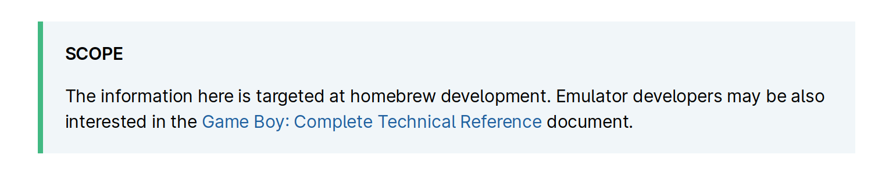

# Contributing

Everyone is welcome to contribute opening issues, expressing feedback, adding and improving content or share new findings. In this document you'll find a series of guidelines on how to do so.

## Issues

The issue tracker is where we discuss what needs to be worked on, and how. You can also browse them [by label](https://github.com/gbdev/pandocs/labels).

### [Board](https://github.com/gbdev/pandocs/projects/1)

We use a "Kanban" board on the Project tab of this repository to organize and prioritize the issues.

Some notes on how the task are organised:

**Triage**: the issues here are still in the "request for comments" phase. The discussion is on-going or not enough information is available to progress. You're welcome to join the discussion, provide references and propose solutions.

**To Do**: stuff here is ready to be worked on. There should be all the information needed to work on a PR to implement a solution for those issues. Anyone can take on those issues and send a PR for those tasks.

## Deploy

Check the [DEPLOY](DEPLOY.md) document to learn how to run a local copy of Pan Docs.

## Community

There are [various community channels](https://gbdev.io/chat.html) where we you can chat directly with maintainers and other contributors.

## Git

Try to follow these guidelines:

- Commit messages should be meaningful, avoid "Update XXX.md". Please describe what you changed, how, and **why**. You can also use the PR message to add details.
- Maintainers: rebase or squash PRs, please do not create merge commits. Avoid leaving formatting/typos/etc. commits in `master`'s history.

In any case, maintainers will chime in, reviewing what you changed and if necessary commit on your branch to help you through the process of preparing the PR.

## Special markup

Pan Docs uses a custom mdBook preprocessor & renderer to enable some special markup:

### Custom Containers

Those mimick Vuepress' [custom containers](https://vuepress.vuejs.org/guide/markdown.html#custom-containers) functionality.

```markdown
  :::type HEADING

  Content

  :::
```

These are rendered as "info boxes".

- `type` must be `tip`, `warning`, or `danger`.
- `HEADING` can contain spaces and will be the title of the box. It should be `Warning`, `Tip`, or something illustrative of what the box contains.
- Both `:::` lines **must** be surrounded by empty lines, otherwise they won't be processed.

E.g.

```markdown
:::tip SCOPE

The information here is targeted at homebrew development.
Emulator developers may be also interested in the [Game Boy: Complete Technical Reference](https://gekkio.fi/files/gb-docs/gbctr.pdf) document.

:::
```

will render as

</img>

### Internal links

```markdown
[VRAM Sprite Attribute Table (OAM)](<#VRAM Sprite Attribute Table (OAM)>)
```

Since Pan Docs contains a lot of internal references, and getting the actual anchor is somewhat tedious, internal links are given special treatment. Links whose URL simply begins with a hash are eligible; the rest of the (pseudo-)URL is treated as a section name (as plain text), and the link made to point to that section.

Note that the angle brackets [are only required if there are spaces in the URL](https://spec.commonmark.org/0.29/#example-485).

In effect, this means that linking to a section is as simple as copy-pasting its name in the URL field, prepending a `#`, and wrapping everything in `<>` if the name contains a space.

### Bit breakdown tables

Quite often, a single byte's various bits, or various bytes in a collection, encode different information.
(For example, the "attributes" byte in OAM, all APU registers, and so on.)
To describe those cases, we use a mix of custom syntax and a list:

```markdown
{{#bits 8
  "Attributes"  7:"Priority" 6:"Y flip" 5:"X flip" 4:"DMG palette" 3:"Bank" 2-0:"CGB palette";
}}

- **Priority**: `0` = No, `1` = BG and Window colors 1-3 over this OBJ
- **Y flip**: `0` = Normal, `1` = Entire OBJ is vertically mirrored
- **X flip**: `0` = Normal, `1` = Entire OBJ is horizontally mirrored
- **DMG palette** *\[Non CGB Mode only\]*: `0` = OBP0, `1` = OBP1
- **Bank** *\[CGB Mode Only\]*: `0` = Fetch tile in VRAM bank 0, `1` = Fetch tile in VRAM bank 1
- **CGB palette** *\[CGB Mode Only\]*: Use OBP0-7
```

- The `{{#bits}}` tag can span several lines for readability.
  It must begin with its "width", i.e. how many bits (columns) there should be, and "direction", i.e. whether columns should be in ascending `<` or descending `>` order.
  Then is a list of *rows*, separated by semicolons `;` (a trailing one is allowed).

  Each row begins by its name, which must be surrounded by double quotes (to allow whitespace in it).
  If the name is empty, then all rows' names must be empty; this will remove the "heading" column entirely.

  Then, there's a list of *fields*, separated by whitespace: first its bit range (where e.g. `3` is equivalent to `3-3`), then its name, also surrounded by double quotes.

  Field names should be succinct, otherwise the table may overflow, particularly on phones.

  (Note: the tag can be escaped by putting a backslash in front of the first brace: `\{{#bits ...}}`; this makes the tag not be processed.)

- The list must document all of the fields with a name.
  Each entry must first contain the name, then any "usage notes" (typically availability, or "ignored if ..." notes) between brackets `[]`, then the read/writability between parentheses.
  Then a colon, and a description of the field.

  Regarding the formatting:
  - The name must be in **bold**, since it's really important information.
  - Anything before the initial colon, except for the name, must be in *italics*.
  - Any values for the field should be put in `monospace/code blocks`; this ensures they stand out.
  - The usage notes can be omitted if there are none.
  - For the sake of readability, if the read/writability of all fields is the same, then it must omitted in the list, but indicated e.g. in the section name, or in main text.

Tables [were agreed upon](https://github.com/gbdev/pandocs/issues/318) as the best way to represent this, but Markdown does not support `colspan`, so a shorthand syntax was developed.

## Document Style

### 1. Pseudocode

- Assignment: :=
- Comparison: =, ≠, <, >, ≤, ≥
- Arithmetic: +, −, ×, ∕, mod
- Floor/ceiling: ⌊, ⌋, ⌈, ⌉.     a :=    ⌊b⌋    + ⌈c⌉
- Logical: and, or, not
- Sums, products: Σ Π

References:
1. http://www.cs.cornell.edu/courses/cs482/2003su/handouts/pseudocode.pdf
2. https://blog.usejournal.com/how-to-write-pseudocode-a-beginners-guide-29956242698
3. https://cs.wmich.edu/gupta/teaching/cs3310/sp18cs3310web/lecture%20notes%20cs3310/PseudocodeBasics.pdf
4. https://en.wikipedia.org/wiki/Pseudocode#Mathematical_style_pseudocode

### 2. Units and prefixes:

- Use binary prefixes (Ki, Mi) for Bytes. E.g.:
  ```
  1 MiB = 2^20 bytes = 1,048,576 bytes
  1 KiB = 2^10 bytes = 1,024 bytes
  ```
- Abbreviate bytes as "B" when used with a prefix. Spell out bits as "bits", even when used with a prefix, to avoid ambiguity. When used as a unit suffix, unit names are always singular, so it should be "20 kbit", not "20 kbits". (Also, "bytes" as a word is fine, just like "30 meters" is a valid way of talking about that length. But "Mbyte" and the like should go away.)
- Hexadecimal values are uppercase and prefixed with `$`: e.g. `$ABCD`. To prevent clutter, don't use a prefix for hex numbers when it's clear from the context that a number is hexadecimal. For example, addresses and lists of opcodes. In those cases, zero-pad, even for smaller numbers: `0000-3FFF` instead of `0-3FFF`.
- Put a space between numbers and their unit (ISO).
- Decimal numbers must be written with a decimal point instead of a comma.
- Binary numbers must be accompanied by the "binary" word.
- Other units (such as Hertz) may use the decimal prefixes (K = 1000, M = 1000000)

References:
- https://superuser.com/questions/938234/size-of-files-in-windows-os-its-kb-or-kb#comment1275467_938259

Discussion:
- [#76](https://github.com/gbdev/pandocs/issues/76), [#55](https://github.com/gbdev/pandocs/issues/55)

### 3. 8 bits / 8-bit

- "8 bits" and "8-bit" have different usages in the English language. The former is used when talking about the quantity ("a byte has 8 bits"), while the latter is used as an adjective ("8-bit bytes are nowadays standard"). "8bit" is obviously wrong, and "8 bit" is likewise incorrect.

Discussion:
- [#102](https://github.com/gbdev/pandocs/issues/102)

### 4. Horizontal Blanking Interval, Vertical Blanking Interval

- VBlank, HBlank, not V-Blank/H-Blank or Vblank/Hblank

Discussion:
- [#94](https://github.com/gbdev/pandocs/issues/94)

### 5. Mentioning models

We use the console codenames, so:

- DMG
- SGB
- MGB (Game Boy Pocket)
- SGB2 (Super Game Boy 2)
- CGB (Game Boy Color)
- AGB (Game Boy Advance)

### 6. Spacing and hyphenation of some terms

- "tile map", not "tilemap"
- "wavelength", not "wave length" ([#350 (comment)](https://github.com/gbdev/pandocs/pull/350#discussion_r709713631))

### 7. Numerical ranges

Those should either be written out (1 to 42), or use an "n-dash" `–` (can also be written as the HTML entity `&ndash;`).

Discussion:
- [#341 (comment)](https://github.com/gbdev/pandocs/pull/341#discussion_r708681099)

### 8. Section titles

Section titles should not use Title Case.

Section titles for memory descriptions (typically, registers) should additionally respect the following rules for consistency.

The format is the following: `Address{–range} — {REG_NAME {(When)}:} Description {[read-only]|[write-only]}`.
All parts between braces are optional, as needed.
Note that the second dash is an em-dash `&mdash;`, not a regular dash/hyphen `-`.

Examples:
- 014D — Header Checksum
- 014E–014F — ROM Checksum
- FF47 — BGP (Non-CGB Mode Only): BG Palette Data
- FF51 — HDMA1 (CGB Mode Only): New DMA Source (High) \[write-only\]

Multiple registers must be handled as a memory range, and the `REG_NAME` and `Description` must be comma-separated lists as necessary.
(It is expected that `When` and `rd-o/wr-o` are identical for all described registers.)

Examples:
- 0104–0133 — Nintendo Logo
- FF51–FF52 — HDMA1, HDMA2 (CGB Mode only): New DMA Source (High, Low) \[write-only\]

It also follows that descriptions should not use commas outside of acting as separators for the aforementioned lists.

A convenience feature is provided for linking to sections, even across files: any link whose URL is only an anchor will be converted into an actual link to the section.
For example, `[sample link text](<#014B — Old licensee code>)` will automatically be turned into `[sample link text](The_Cartridge_Header.html#014b--old-licensee-code)`.
References to missing sections will be left as-is, and ambiguous references resolved arbitrarily (this should eventually change).
(Note that the use of angle brackets `<>` here is [a CommonMark feature](https://spec.commonmark.org/0.30/#link-destination) to allow spaces in the link destination.)

## SVG 

### Rationale

The preferred format for diagrams in Pan Docs is SVG.
- ASCII, Unicode, or text-only diagrams are not accessible (screen readers, etc.)
- "Raster" images do not scale, and e.g. text within them cannot be selected.
- Additionally, raster images may be troublesome to post-edit without extra "source" files (e.g. XCF or PSD files).
- Lastly, SVGs can be dynamically styled, allowing for better integration within the page.

### Guidelines

SVGs can be created using a lot of programs: [Inkscape](https://inkscape.org), a text editor ([SVGs are just XML documents!](https://developer.mozilla.org/en-US/docs/Web/SVG)), and others.

**Be wary of "image to SVG converters"**, as these tend to just embed the raster image within a SVG document, which most of the time generates a larger file with none of the benefits expected from a SVG.

"Raster" images, like PNG, JPEG, BMP, and so on, store pixels.
SVGs (and more generally, "vector" graphics) instead contain commands to draw shapes.
For this reason, and because computers are bad at recognizing shapes, **converting from the former to the latter has to be largely done by hand from scratch**.
(On the other hand, it's a good time to go over any improvements that can be brought to the diagram!)

### Dynamically-styled SVGs

A good reference is [this commit](https://github.com/gbdev/pandocs/commit/be820673f71c8ca514bab4d390a3004c8273f988#diff-806f4be9ec1ba99e972f48151ca8a3f19d3048a7dbe6f39853dff85ee01806e6).
(NB: only the new SVG file and the modification to `src/pixel_fifo.md` need to be considered. The rest is cleanup and plumbing.)
It may be a good idea to check out that example if you aren't sure and want to check something.

SVGs can be displayed in a page in two ways: either linked to from an `` tag, or embedded directly in the HTML document via a `<svg>` tag.
[Due to technicalities](https://stackoverflow.com/questions/18434094/how-to-style-svg-with-external-css), SVGs cannot access the parent document's style sheet when displayed using the former method.

The way themes change styling is using [CSS variables](https://developer.mozilla.org/en-US/docs/Web/CSS/--*), specifically [all of these](https://github.com/rust-lang/mdBook/blob/d22299d9985eafc87e6103974700a3eb8e24d73d/src/theme/css/variables.css#L11-L210).
The variables can be reused within a SVG's stylesheet to make it automatically update its style when a new theme is selected, but this requires embedding the SVG within the page for it to have access to those variables.

#### How-to

In theory, pasting the SVG directly within the Markdown document would work.
However, this increases its size a lot, and thus hinders navigation; it also makes the SVG impossible to view and edit on its own.
For these reasons, use of mdBook's ["include" mechanism](https://rust-lang.github.io/mdBook/format/mdbook.html#including-files) is preferred.

First, create the SVG file itself; see further above for general directions.
To have the SVG be dynamically styled, you will likely have to open it in a text editor and manually change it.
Locate the `<defs>` element directly within the `<svg>` tag, and then the `<style>` tag within that.
Create those as necessary if they aren't present.

Now, add CSS rules to style the elements (although CSS within SVGs affects [different attributes](https://developer.mozilla.org/en-US/docs/Web/SVG/Attribute), so [some attributes have different names](https://developer.mozilla.org/en-US/docs/Web/SVG/Attribute/fill#text)).
You can add classes and/or IDs to the elements as normal, and use those in CSS selectors.

Once that is done, you must ensure that the file contains **no empty lines** (whitespace doesn't count) after the opening `<svg>` tag.
Any blank lines will break the Markdown markup, and likely yield a broken image.
Additionally, remember which line the opening `<svg>` tag is on for the next step.

Then, add a directive to embed the file's contents, for example `{{#include imgs/ppu_modes_timing.svg:2:}}`.
Replace `imgs/ppu_modes_timing.svg` with the path to the SVG from the `src/` folder, and `2` with the line number the opening `<svg>` tag is on.

A word of caution about the directive's placement: if it is surrounded by empty lines, the image will be outside of any paragraphs, within the document's main flow.
However, if it is adjacent to a line of text, it may be placed within the paragraph, which is likely not what you want.
