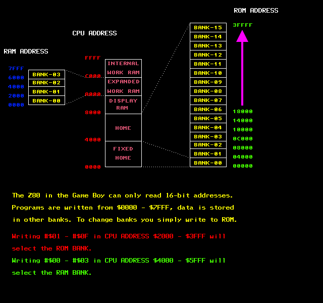

# Pan Docs

> ### The single, most comprehensive technical reference to Game Boy available to the public.


**WIP NOTICE**: This is a community effort to give this document a new form. Everything is still work in progress. You're welcome to [contribute](#contributing).

## History

Pan Docs - also known as `GAMEBOY.TXT` or `GBSPEC.TXT` - is an old document dating back to early 1995 originally written by *Pan of Anthrox*. It has been one of the most important references for Game Boy hackers, emulators and homebrew developers during the last 25 years.

<p align="center">

<br>
  <i>ADDRESS1.PCX, one of the diagrams attached to the first version, released January 28th, 1995</i>
</p>

After its release (1995-2008), it received a number of revisions, corrections and updates, maintaining its **TXT format**. This [folder](historical/) provides a historical archive of those versions.

In 2008, a **wikified** version (using Martin Korth's 2001 revision as a baseline) has been published. The document was split into different articles and it continued being maintained and updated in that form.

In 2020, we want to make this repository the new home of this resource, where it can receive new public discussions and contributions, maintain its legacy and historical relevance, while making use of recent tools to be visualized and distributed.

Everything is in plain Markdown and easily editable by anyone with a GitHub account by clicking the "Edit" button on the web UI. We accept contributions, patches, suggestions and feedback via email, too (`pandocs (at) gbdev.io`).

## Contributing 

[This](https://github.com/gbdev/awesome-gbdev/issues/153) is the RFC proposing the change. You're welcome to discuss the development of this project in our various community channels found [here](https://gbdev.io/chat.html).

Contributing is really easy, fork this repo and edit the files in the **content** directory. Then, you can send your PR.

To deploy Pandocs locally:

```bash
# Clone the repository
git clone https://github.com/gbdev/pandocs
# Move to the render folder
cd render
# Install npm dependencies (web app)
npm install
# Install Python dependencies (needed to merge every markdown file into one)
pip3 install -r requirements.txt
# Run the merge script
bash merge.sh
# Run locally the web documentation
npx vuepress dev
# Pandocs is live at localhost:8080
```

Now, simply edit the markdown files inside the **content** directory, rerun `bash merge.sh` and you should see the result updated at `localhost:8080`.

## License

We assume the content to be in the [public domain](LICENSE).
