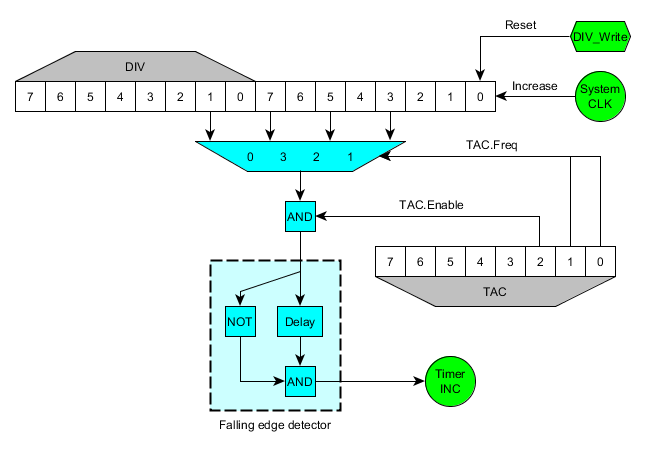

### Relation between Timer and Divider register

This is a schematic of the circuit involving TAC and DIV:

Notice how the values that are connected to the inputs of the
multiplexer are the values of those bits, not the carry of those bits.
This is the reason of a few things:

\- When writing to DIV, the whole counter is reseted, so the timer is
also affected.

\- When writing to DIV, if the current output is \'1\' and timer is
enabled, as the new value after reseting DIV will be \'0\', the falling
edge detector will detect a falling edge and TIMA will increase.

\- When writing to TAC, if the previously selected multiplexer input was
\'1\' and the new input is \'0\', TIMA will increase too. This doesn\'t
happen when the timer is disabled, but it also happens when disabling
the timer (the same effect as writing to DIV). The following code
explains the behaviour in DMG and MGB.

    clocks_array[4] = {1024, 16, 64, 256}

    old_clocks = clocks_array[old_TAC&3]
    new_clocks = clocks_array[new_TAC&3]

    old_enable = old_TAC & BIT(2)
    new_enable = new_TAC & BIT(2)

    sys_clocks = 16 bit system counter

    IF old_enable == 0 THEN
        glitch = 0 (*)
    ELSE
        IF new_enable == 0 THEN
            glitch = (sys_clocks & (old_clocks/2)) != 0
        ELSE
            glitch = ((sys_clocks & (old_clocks/2)) != 0) && ((sys_clocks & (new_clocks/2)) == 0)
        END IF
    END IF

