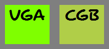

# LCD Status Register

::: tip TERMINOLOGY
A *dot* is the shortest period over which the PPU can output one pixel: is it equivalent to 1 T-state on DMG or on CGB single-speed mode or 2 T-states on CGB double-speed mode. On each dot during mode 3, either the PPU outputs a pixel or the fetcher is stalling the [FIFOs](#pixel-fifo).
:::

### FF41 - STAT (LCD Status) (R/W)

```
Bit 6 - LYC=LY Interrupt             (1=Enable) (Read/Write)
Bit 5 - Mode 2 OAM Interrupt         (1=Enable) (Read/Write)
Bit 4 - Mode 1 V-Blank Interrupt     (1=Enable) (Read/Write)
Bit 3 - Mode 0 H-Blank Interrupt     (1=Enable) (Read/Write)
Bit 2 - LYC=LY Flag      (0=Different, 1=Equal) (Read Only)
Bit 1-0 - Mode Flag       (Mode 0-3, see below) (Read Only)
          0: In H-Blank
          1: In V-Blank
          2: Searching OAM
          3: Transferring Data to LCD Controller
```

The two lower STAT bits show the current status of the PPU.

The LCD controller operates on a 2^22 Hz = 4.194 MHz dot clock. An
entire frame is 154 scanlines, 70224 dots, or 16.74 ms. On scanlines 0
through 143, the PPU cycles through modes 2, 3, and 0 once
every 456 dots. Scanlines 144 through 153 are mode 1.

The following sequence is typical when the display is enabled:

```
Mode 2  2_____2_____2_____2_____2_____2___________________2____
Mode 3  _33____33____33____33____33____33__________________3___
Mode 0  ___000___000___000___000___000___000________________000
Mode 1  ____________________________________11111111111111_____
```

When the PPU is reading a particular part of video memory,
that memory is inaccessible to the CPU.

-   During modes 2 and 3, the CPU cannot access OAM (FE00h-FE9Fh).
-   During mode 3, the CPU cannot access VRAM or CGB Palette Data
    (FF69,FF6B).

| Mode    | Action                                                                | Duration                                                           | Accessible video memory
|---------|-----------------------------------------------------------------------|--------------------------------------------------------------------|-------------------------
|    2    | Searching OAM for OBJs whose (X,Y) coordinates overlap this line      | 80 dots (19 us)                                                    | VRAM, CGB palettes
|    3    | Reading OAM and VRAM to generate the picture                          | 168 to 291 dots (40 to 60 us) depending on sprite count            | None
|    0    | Horizontal blanking                                                   | 85 to 208 dots (20 to 49 us) depending on previous mode 3 duration | VRAM, OAM, CGB palettes
|    1    | Vertical blanking                                                     | 4560 dots (1087 us, 10 scanlines)                                  | VRAM, OAM, CGB palettes

### Properties of STAT modes

Unlike most game consoles, the Game Boy can pause the dot clock briefly,
adding dots to mode 3's duration. It routinely takes a 6 to 11 dot
break to fetch sprite patterns between background tile pattern fetches.
On DMG and GBC in DMG mode, mid-scanline writes to `BGP` allow observing
this behavior, as a sprite delay shifts the effect of a write to the
left by that many dots.

Three things are known to pause the dot clock:

- Background scrolling: If `SCX mod 8` is not zero at the start of the scanline, rendering is paused for that many dots while the shifter discards that many pixels from the leftmost tile.
- Window: An active window pauses for at least 6 dots, as the background fetching mechanism starts over at the left side of the window.
- Sprites: Each sprite usually pauses for `11 - min(5, (x + SCX) mod 8)` dots. Because sprite fetch waits for background fetch to finish, a sprite's cost depends on its position relative to the left side of the background tile under it. It's greater if a sprite is directly aligned over the background tile, less if the sprite is to the right. If the sprite's left side is over the window, use `255 - WX` for `SCX` in this formula.

::: warning TO BE VERIFIED
The exact pause duration for window start is
not confirmed; it may have the same background fetch finish delay as a
sprite. If two sprites' left sides are over the same background or
window tile, the second may pause for fewer dots.
:::

A hardware quirk in the monochrome Game Boy makes the LCD interrupt
sometimes trigger when writing to STAT (including writing \$00) during
OAM scan, H-Blank, V-Blank, or LY=LYC. It behaves as if \$FF were
written for one cycle, and then the written value were written the next
cycle. Because the GBC in DMG mode does not have this quirk, two games
that depend on this quirk (Ocean's *Road Rash* and Vic Tokai's *Xerd
no Densetsu*) will not run on a GBC.

# LCD Interrupts

### INT 40 - V-Blank Interrupt

The V-Blank interrupt occurs ca. 59.7 times a second on a handheld Game
Boy (DMG or CGB) or Game Boy Player and ca. 61.1 times a second on a
Super Game Boy (SGB). This interrupt occurs at the beginning of the
V-Blank period (LY=144). During this period video hardware is not using
VRAM so it may be freely accessed. This period lasts approximately 1.1
milliseconds.

### INT 48 - STAT Interrupt

There are various reasons for this interrupt to occur as described by
the STAT register (\$FF41). One very popular reason is to indicate to
the user when the video hardware is about to redraw a given LCD line.
This can be useful for dynamically controlling the SCX/SCY registers
($FF43/$FF42) to perform special video effects.

Example application: set LYC to WY, enable LY=LYC interrupt, and have
the handler disable sprites. This can be used if you use the window for
a text box (at the bottom of the screen), and you want sprites to be
hidden by the text box.

::: warning
As mentioned in the description of the STAT register, the PPU cycles
through the different modes in a fixed order. If we set the STAT bits
in a way that they would interrupt the CPU at two
consecutive modes, then the second interrupt will not trigger. So for example,
if we enable the interrupts for Mode 0 and Mode 1,
the Mode 1 interrupt will not trigger.
:::

# LCD Position and Scrolling

These registers can be accessed even during Mode 3, but they have no
effect until the end of the current scanline.

### FF42 - SCY (Scroll Y) (R/W), FF43 - SCX (Scroll X) (R/W)

Specify the top-left coordinates of the visible 160x144 pixel area within the
256x256 pixels BG map. Values in the range 0-255 may be used.

### FF44 - LY (LCDC Y-Coordinate) (R)

LY indicates the current horizontal line, which might be about to be drawn,
being drawn, or just been drawn. LY can hold any value from 0 to 153.
The values from 144 to 153 indicate the VBlank period.

### FF45 - LYC (LY Compare) (R/W)

The Game Boy permanently compares the value of the LYC and LY registers.
When both values are identical, the "LYC=LY" flag in the STAT register
is set, and (if enabled) a STAT interrupt is requested.

### FF4A - WY (Window Y Position) (R/W), FF4B - WX (Window X Position + 7) (R/W)

Specify the top-left coordinates of the Window. (The Window is an
alternate background area which can be displayed above of the normal
background. OBJs (sprites) may be still displayed above or behind the
Window, just as for normal BG.)

The Window is visible (if enabled) when both coordinates are in the ranges
WX=0..166, WY=0..143 respectively. Values WX=7, WY=0 place the Window at the
top left of the screen, completely covering the background.

WX values 0-6 and 166 are unreliable due to hardware bugs. If WX is set
to 0, the window will "stutter" horizontally when SCX changes.
(Depending on SCX modulo 8, behavior is a little complicated so you
should try it yourself.)

# LCD Monochrome Palettes

### FF47 - BGP (BG Palette Data) (R/W) - Non CGB Mode Only

This register assigns gray shades to the color indexes of the BG and
Window tiles.

```
Bit 7-6 - Color for index 3
Bit 5-4 - Color for index 2
Bit 3-2 - Color for index 1
Bit 1-0 - Color for index 0
```

Value | Color
------|-------
  0   | White
  1   | Light gray
  2   | Dark gray
  3   | Black

In CGB Mode the Color Palettes are taken from CGB Palette Memory
instead.

### FF48 - OBP0 (Object Palette 0 Data) (R/W) - Non CGB Mode Only

This register assigns gray shades to the color indexes of the OBJs that use this palette. It works exactly
like BGP (FF47), except that the lower two bits are ignored because
sprite index 00 means transparent.

### FF49 - OBP1 (Object Palette 1 Data) (R/W) - Non CGB Mode Only

This register assigns gray shades to the color indexes of the OBJs that use this palette. It works exactly
like BGP (FF47), except that the lower two bits are ignored because
sprite index 00 means transparent.

# LCD Color Palettes (CGB only)

### FF68 - BCPS/BGPI (Background Color Palette Specification or Background Palette Index) - CGB Mode Only

This register is used to address a byte in the CGBs Background Palette
Memory. Each two byte in that memory define a color value. The first 8
bytes define Color 0-3 of Palette 0 (BGP0), and so on for BGP1-7.

```
Bit 7     Auto Increment  (0=Disabled, 1=Increment after Writing)
Bit 5-0   Index (00-3F)
```

Data can be read/written to/from the specified index address through
Register FF69. When the Auto Increment bit is set then the index is
automatically incremented after each **write** to FF69. Auto Increment has
no effect when **reading** from FF69, so the index must be manually
incremented in that case. Writing to FF69 during rendering still causes
auto-increment to occur.

Unlike the following, this register can be accessed outside V-Blank and
H-Blank.

### FF69 - BCPD/BGPD (Background Color Palette Data or Background Palette Data) - CGB Mode Only

This register allows to read/write data to the CGBs Background Palette
Memory, addressed through Register FF68. Each color is defined by two
bytes (Bit 0-7 in first byte).

```
Bit 0-4   Red Intensity   (00-1F)
Bit 5-9   Green Intensity (00-1F)
Bit 10-14 Blue Intensity  (00-1F)
```

Much like VRAM, data in Palette Memory cannot be read/written during the
time when the LCD Controller is reading from it. (That is when the STAT
register indicates Mode 3). Note: All background colors are initialized
as white by the boot ROM, but it's a good idea to initialize at least
one color yourself (for example if you include a soft-reset mechanic).

### FF6A - OCPS/OBPI (Object Color Palette Specification or Sprite Palette Index), FF6B - OCPD/OBPD (Object Color Palette Data or Sprite Palette Data) - Both CGB Mode Only

These registers are used to initialize the Sprite Palettes OBP0-7,
identically as described above for Background Palettes. Note that four
colors may be defined for each OBP Palettes - but only Color 1-3 of each
Sprite Palette can be displayed, Color 0 is always transparent, and can
be initialized to a don't care value or plain never initialized.

Note: All sprite colors are left uninitialized by the boot ROM, and are
somewhat random.

### RGB Translation by CGBs



When developing graphics on PCs, note that the RGB values will have
different appearance on CGB displays as on VGA/HDMI monitors calibrated
to sRGB color. Because the GBC is not lit, the highest intensity will
produce Light Gray color rather than White. The intensities are not
linear; the values 10h-1Fh will all appear very bright, while medium and
darker colors are ranged at 00h-0Fh.

The CGB display's pigments aren't perfectly saturated. This means the
colors mix quite oddly; increasing intensity of only one R,G,B color
will also influence the other two R,G,B colors. For example, a color
setting of 03EFh (Blue=0, Green=1Fh, Red=0Fh) will appear as Neon Green
on VGA displays, but on the CGB it'll produce a decently washed out
Yellow. See image on the right.

### RGB Translation by GBAs

Even though GBA is described to be compatible to CGB games, most CGB
games are completely unplayable on older GBAs because most colors are
invisible (black). Of course, colors such like Black and White will
appear the same on both CGB and GBA, but medium intensities are arranged
completely different. Intensities in range 00h..07h are invisible/black
(unless eventually under best sunlight circumstances, and when gazing at
the screen under obscure viewing angles), unfortunately, these
intensities are regularly used by most existing CGB games for medium and
darker colors.

Newer CGB games may avoid this effect by changing palette data when
detecting GBA hardware ([see
how](#detecting-cgb-and-gba-functions)).
Based on measurement of GBC and GBA palettes using the [144p Test
Suite](https://github.com/pinobatch/240p-test-mini/tree/master/gameboy) ROM, a fairly close approximation is GBA = GBC \* 3/4 + 8h for
each R,G,B intensity. The result isn't quite perfect, and it may turn
out that the color mixing is different also; anyways, it'd be still
ways better than no conversion.

This problem with low brightness levels does not affect later GBA SP
units and Game Boy Player. Thus ideally, the player should have control
of this brightness correction.

# LCD OAM DMA Transfers

### FF46 - DMA (DMA Transfer and Start Address) (R/W)

Writing to this register launches a DMA transfer from ROM or RAM to OAM
memory (sprite attribute table). The written value specifies the
transfer source address divided by $100, that is, source and destination are:

```
Source:      $XX00-$XX9F   ;XX = $00 to $DF
Destination: $FE00-$FE9F
```

The transfer takes 160 machine cycles: 152 microseconds in normal speed
or 76 microseconds in CGB Double Speed Mode. On DMG, during this time,
the CPU can access only HRAM (memory at $FF80-$FFFE); on CGB, the bus used
by the source area cannot be used (this isn't understood well at the
moment; it's recommended to assume same behavior as DMG). For this
reason, the programmer must copy a short procedure into HRAM, and use
this procedure to start the transfer from inside HRAM, and wait until
the transfer has finished:

```
 run_dma:
  ld a, start address / $100
  ldh  [$FF46],a ;start DMA transfer (starts right after instruction)
  ld  a,$28      ;delay...
 wait:           ;total 4x40 cycles, approx 160 μs
  dec a          ;1 cycle
  jr  nz,wait    ;3 cycles
  ret
```

Because sprites are not displayed while OAM DMA is in progress, most
programs execute this procedure from inside their V-Blank
handler. But it is also possible to execute it during display redraw (Modes 2 and 3),
allowing to display more than 40 sprites on the screen (that is, for
example 40 sprites in the top half, and other 40 sprites in the bottom half of
the screen), at the cost of a couple lines that lack sprites due to the fact that
during those couple lines the PPU reads OAM as $FF. Besides, graphic glitches may
happen if starting OAM DMA during Mode 3.

A more compact procedure is

```
 run_dma:  ; This part is in ROM
  ld a, start address / $100
  ld bc, $2946  ; B: wait time; C: OAM trigger
  jp run_dma_hrampart

 run_dma_hrampart:
  ldh [$FF00+c], a
 wait:
  dec b
  jr nz,wait
  ret
```

which should be called with a = start address / $100, bc = $2946. This
saves 5 bytes of HRAM, but is slightly slower in most cases due to
the jump into the HRAM part.

# LCD VRAM DMA Transfers (CGB only)

### FF51 - HDMA1 (New DMA Source, High) - CGB Mode Only

### FF52 - HDMA2 (New DMA Source, Low) - CGB Mode Only

These two registers specify the address at which the transfer will read
data from. Normally, this should be either in ROM, SRAM or WRAM, thus
either in range 0000-7FF0 or A000-DFF0. \[Note: this has yet to be
tested on Echo RAM, OAM, FEXX, IO and HRAM\]. Trying to specify a source
address in VRAM will cause garbage to be copied.

The four lower bits of this address will be ignored and treated as 0.

### FF53 - HDMA3 (New DMA Destination, High) - CGB Mode Only

### FF54 - HDMA4 (New DMA Destination, Low) - CGB Mode Only

These two registers specify the address within 8000-9FF0 to which the
data will be copied. Only bits 12-4 are respected; others are ignored.
The four lower bits of this address will be ignored and treated as 0.

### FF55 - HDMA5 (New DMA Length/Mode/Start) - CGB Mode Only

These registers are used to initiate a DMA transfer from ROM or RAM to
VRAM. The Source Start Address may be located at 0000-7FF0 or A000-DFF0,
the lower four bits of the address are ignored (treated as zero). The
Destination Start Address may be located at 8000-9FF0, the lower four
bits of the address are ignored (treated as zero), the upper 3 bits are
ignored either (destination is always in VRAM).

Writing to this register starts the transfer, the lower 7 bits of which
specify the Transfer Length (divided by 10h, minus 1), that is, lengths of
10h-800h bytes can be defined by the values 00h-7Fh. The upper bit
indicates the Transfer Mode:

**Bit7=0 - General Purpose DMA**

When using this transfer method,
all data is transferred at once. The execution of the program is halted
until the transfer has completed. Note that the General Purpose DMA
blindly attempts to copy the data, even if the LCD controller is
currently accessing VRAM. So General Purpose DMA should be used only if
the Display is disabled, or during V-Blank, or (for rather short blocks)
during H-Blank. The execution of the program continues when the transfer
has been completed, and FF55 then contains a value of FFh.

**Bit7=1 - H-Blank DMA**

The H-Blank DMA transfers 10h bytes of
data during each H-Blank, that is, at LY=0-143, no data is transferred during
V-Blank (LY=144-153), but the transfer will then continue at LY=00. The
execution of the program is halted during the separate transfers, but
the program execution continues during the "spaces" between each data
block. Note that the program should not change the Destination VRAM bank
(FF4F), or the Source ROM/RAM bank (in case data is transferred from
bankable memory) until the transfer has completed! (The transfer should
be paused as described below while the banks are switched)

Reading from Register FF55 returns the remaining length (divided by 10h,
minus 1), a value of 0FFh indicates that the transfer has completed. It
is also possible to terminate an active H-Blank transfer by writing zero
to Bit 7 of FF55. In that case reading from FF55 will return how many
\$10 "blocks" remained (minus 1) in the lower 7 bits, but Bit 7 will
be read as "1". Stopping the transfer doesn't set HDMA1-4 to \$FF.

::: warning

H-Blank DMA should not be started (write to FF55) during a H-Blank
period (STAT mode 0).

If the transfer's destination address overflows, the transfer stops
prematurely. \[Note: what's the state of the registers if this happens
?\]
:::

### Confirming if the DMA Transfer is Active

Reading Bit 7 of FF55 can be used to confirm if the DMA transfer is
active (1=Not Active, 0=Active). This works under any circumstances -
after completion of General Purpose, or H-Blank Transfer, and after
manually terminating a H-Blank Transfer.

### Transfer Timings

In both Normal Speed and Double Speed Mode it takes about 8 μs to
transfer a block of 10h bytes. That are 8 tstates in Normal Speed Mode,
and 16 "fast" tstates in Double Speed Mode. Older MBC controllers
(like MBC1-4) and slower ROMs are not guaranteed to support General
Purpose or H-Blank DMA, that's because there are always 2 bytes
transferred per microsecond (even if the itself program runs it Normal
Speed Mode).

# VRAM Tile Data

Tile data is stored in VRAM in the memory area at \$8000-$97FF; with each tile
taking 16 bytes, this area defines data for 384 tiles. In CGB Mode,
this is doubled (768 tiles) because of the two VRAM banks.

Each tile has 8x8 pixels and has a color depth of 4 colors/gray
shades. Tiles can be displayed as part of the Background/Window maps,
and/or as OBJ tiles (foreground sprites). Note that OBJs
don't use color 0 - it's transparent instead.

There are three "blocks" of 128 tiles each:

-   Block 0 is $8000-$87FF
-   Block 1 is $8800-$8FFF
-   Block 2 is $9000-$97FF

Tiles are always indexed using a 8-bit integer, but the addressing
method may differ. The "$8000 method" uses \$8000 as its base pointer
and uses an unsigned addressing, meaning that tiles 0-127 are in block
0, and tiles 128-255 are in block 1. The "$8800 method" uses \$9000 as
its base pointer and uses a signed addressing, meaning that tiles 0-127
are in block 2, and tiles -128 to -1 are in block 1, or to put it differently,
"$8800 addressing" takes tiles 0-127 from block 2
and tiles 128-255 from block 1. (You can notice that block 1 is shared
by both addressing methods)

Sprites always use "$8000 addressing", but the BG and Window can use either
mode, controlled by [LCDC bit
4](#lcdc-4-bg-window-tile-data-select).

Each tile occupies 16 bytes, where each line is represented by 2 bytes:

```
Byte 0-1  Topmost Line (Top 8 pixels)
Byte 2-3  Second Line
etc.
```

For each line, the first byte specifies the least significant bit of the
color ID of each pixel, and the second byte specifies the most significant bit.
In both bytes, bit 7 represents the leftmost pixel, and
bit 0 the rightmost. For example: let's say you have \$57 \$36 (in
this order in memory), which in binary are %01010111 and %00110110.
To obtain the color ID for the leftmost pixel,
you take bit 7 of both bytes: 0, and 0. Thus the index is %00 = 0. For
the second pixel, repeat with bit 6: 1, and 0. Thus the index is %01 =
1 (remember to flip the order of the bits!). If you repeat the
operation you'll find that the IDs for the eight pixels are 0 1 2 3 0 3
3 1.

A more visual explanation can be found
[here](https://www.huderlem.com/demos/gameboy2bpp.html).

So, each pixel has a color ID of 0 to 3. The color
numbers are translated into real colors (or gray shades) depending on
the current palettes, except that when the tile is used in a OBJ the
color ID 0 means transparent. The palettes are defined through registers
[BGP](#ff47-bgp-bg-palette-data-r-w-non-cgb-mode-only),
[OBP0](#ff48-obp0-object-palette-0-data-r-w-non-cgb-mode-only)
and
[OBP1](#ff49-obp1-object-palette-1-data-r-w-non-cgb-mode-only)
(Non CGB Mode), and
[BCPS/BGPI](#ff68-bcps-bgpi-cgb-mode-only-background-color-palette-specification-or-background-palette-index),
[BCPD/BGPD](#ff69-bcpd-bgpd-cgb-mode-only-background-color-palette-data-or-background-palette-data),
[OCPS/OBPI and
OCPD/OBPD](#ff6a-ocps-obpi-object-color-palette-specification-or-sprite-palette-index-ff6b-ocpd-obpd-object-color-palette-data-or-sprite-palette-data-both-cgb-mode-only)
(CGB Mode).


# VRAM Tile Maps

The Game Boy contains two 32x32 tile maps in VRAM at
the memory areas `$9800-$9BFF` and `$9C00-$9FFF`. Any of these maps can be used to
display the Background or the Window.

### Tile Indexes

Each tile map contains the 1-byte indexes of the
tiles to be displayed.

Tiles are obtained from the Tile Data Table using either of the two
addressing modes (described [above](#vram-tile-data)), which
can be selected via the LCDC register.

Since one tile has 8x8 pixels, each map holds a
256x256 pixels picture. Only 160x144 pixels may be displayed on the LCD at any
given time.

### BG Map Attributes (CGB Mode only)

In CGB Mode, an additional map of 32x32 bytes is stored in VRAM Bank 1
(each byte defines attributes for the corresponding tile-number map
entry in VRAM Bank 0, that is, 1:9800 defines the attributes for the tile at
0:9800):

```
Bit 7    BG-to-OAM Priority         (0=Use OAM Priority bit, 1=BG Priority)
Bit 6    Vertical Flip              (0=Normal, 1=Mirror vertically)
Bit 5    Horizontal Flip            (0=Normal, 1=Mirror horizontally)
Bit 4    Not used
Bit 3    Tile VRAM Bank number      (0=Bank 0, 1=Bank 1)
Bit 2-0  Background Palette number  (BGP0-7)
```

When Bit 7 is set, the corresponding BG tile will have priority above
all OBJs (regardless of the priority bits in OAM memory). There's also
a Master Priority flag in LCDC register Bit 0 which overrides all other
priority bits when cleared.

Note that, if the map entry at `0:9800` is tile \$2A, the attribute at
`1:9800` doesn't define properties for ALL tiles \$2A on-screen, but only
the one at `0:9800`!

### Background (BG)

The [SCY and SCX](#ff42-scy-scroll-y-r-w-ff43-scx-scroll-x-r-w) registers can be
used to scroll the Background, specifying the origin of the visible
160x144 pixel area within the total 256x256 pixel Background map.
The Background visible area wraps around the Background map (that is, when part of
the visible area goes beyond the map edge, it starts displaying the opposite side of the map).

In Non-CGB mode, the Background (and the Window) can be disabled using
[LCDC bit 0](#lcdc-0-bg-window-display-priority).

### Window

Besides the Background, there is also a Window overlaying it.
The content of the Window is not scrollable; it is always
displayed starting at the top left tile of its tile map. The only way to adjust the Window
is by modifying its position on the screen, which is done via the WX and WY registers. The screen
coordinates of the top left corner of the Window are (WX-7,WY). The tiles
for the Window are stored in the Tile Data Table. Both the Background
and the Window share the same Tile Data Table.

Whether the Window is displayed can be toggled using
[LCDC bit 5](#lcdc-5-window-display-enable). But in Non-CGB mode this bit is only
significant if [LCDC bit 0](#lcdc-0-bg-window-display-priority) is set.
Enabling the Window makes
[Mode 3](#lcd-status-register) slightly longer on scanlines where it's visible.
(See [above](#ff4a-wy-window-y-position-r-w-ff4b-wx-window-x-position-minus-7-r-w)
for the definition of "Window visibility".)

# VRAM Banks (CGB only)

The CGB has twice the VRAM of the DMG, but it is banked and either bank
has a different purpose.

### FF4F - VBK - CGB Mode Only - VRAM Bank (R/W)

This register can be written to to change VRAM banks. Only bit 0
matters, all other bits are ignored.

### VRAM bank 1

VRAM bank 1 is split like VRAM bank 0 ; 8000-97FF also stores tiles
(just like in bank 0), which can be accessed the same way as (and at the
same time as) bank 0 tiles. 9800-9FFF contains the attributes for the
corresponding Tile Maps.

Reading from this register will return the number of the currently
loaded VRAM bank in bit 0, and all other bits will be set to 1.

# VRAM Sprite Attribute Table (OAM)

The Game Boy PPU can display up to 40 sprites either in 8x8 or
in 8x16 pixels. Because of a limitation of hardware, only ten sprites
can be displayed per scan line. Sprite tiles have the same format as
BG tiles, but they are taken from the Sprite Tiles Table located at
$8000-8FFF and have unsigned numbering.

Sprite attributes reside in the Sprite Attribute Table (OAM - Object
Attribute Memory) at \$FE00-FE9F. Each of the 40 entries consists of
four bytes with the following meanings:

### Byte0 - Y Position

Y = Sprite's vertical position on the screen + 16. So for example,
Y=0 hides a sprite,
Y=2 hides a 8x8 sprite but displays the last two rows of a 8x16 sprite,
Y=16 displays a sprite at the top of the screen,
Y=144 displays a 8x16 sprite aligned with the bottom of the screen,
Y=152 displays a 8x8 sprite aligned with the bottom of the screen,
Y=154 displays the first six rows of a sprite at the bottom of the screen,
Y=160 hides a sprite.

### Byte1 - X Position

X = Sprite's horizontal position on the screen + 8. This works similarly
to the examples above, except that the width of a sprite is always 8. An
off-screen value (X=0 or X\>=168) hides the sprite, but the sprite still
affects the priority ordering, thus other sprites with lower priority may be
left out due to the ten sprites limit per scan-line.
A better way to hide a sprite is to set its Y-coordinate off-screen.

### Byte 2 - Tile Index

In 8x8 mode (LCDC bit 2 = 0), this byte specifies the sprite's only tile index ($00-$FF).
This unsigned value selects a tile from the memory area at $8000-$8FFF.
In CGB Mode this could be either in
VRAM bank 0 or 1, depending on bit 3 of the following byte.
In 8x16 mode (LCDC bit 2 = 1), the memory area at $8000-$8FFF is still interpreted
as a series of 8x8 tiles, where every 2 tiles form a sprite. In this mode, this byte
specifies the index of the first (top) tile of the sprite. This is enforced by the
hardware: the least significant bit of the tile index is ignored; that is, the top 8x8
tile is "NN & $FE", and the bottom 8x8 tile is "NN | $01".

### Byte3 - Attributes/Flags:

```
 Bit7   BG and Window over OBJ (0=No, 1=BG and Window colors 1-3 over the OBJ)
 Bit6   Y flip          (0=Normal, 1=Vertically mirrored)
 Bit5   X flip          (0=Normal, 1=Horizontally mirrored)
 Bit4   Palette number  **Non CGB Mode Only** (0=OBP0, 1=OBP1)
 Bit3   Tile VRAM-Bank  **CGB Mode Only**     (0=Bank 0, 1=Bank 1)
 Bit2-0 Palette number  **CGB Mode Only**     (OBP0-7)
```

### Sprite Priorities and Conflicts

During each scanline's OAM scan, the PPU compares LY to each
sprite's Y position to find the 10 sprites on that line that appear
first in OAM (\$FE00-\$FE03 being the first). It discards the rest,
displaying only those 10 sprites on that line.
To keep unused sprites from affecting onscreen sprites, set their Y
coordinate to Y = 0 or Y \>= 160 (144 + 16) (Note: Y \<= 8 also works
if sprite size is set to 8x8). Just setting the X coordinate to X = 0 or
X \>= 168 (160 + 8) on a sprite will hide it, but it will still count
towards the 10 sprite limit per scanline, possibly causing another sprite
that appears later in OAM to be left undisplayed.

If using BGB, in the VRAM viewer - OAM tab, hover your
mouse over the small screen to highlight the sprites on a line. Sprites
hidden due to the limitation will be highlighted in red.

When these 10 sprites overlap, the highest priority one will appear
above all others, etc. (Thus, no Z-fighting.) In Non-CGB mode, the smaller the X
coordinate, the higher the priority. When X coordinates are the same, sprites located
first in OAM have a higher priority. In CGB mode, only the sprite's location in OAM
determines its priority.

::: tip NOTE
Priority among opaque pixels that overlap is determined using the rules explained
above. After the pixel with the highest priority has been determined,
the "BG and Window over OBJ" attribute of *only* that pixel is honored (or disregarded if
this is a transparent pixel, i.e. a pixel with color ID zero). Thus if a sprite with a
higher priority but with "BG and Window over OBJ" toggled on
overlaps a sprite with a lower priority and a nonzero background
pixel, the background pixel is displayed regardless of the
lower-priority sprite's "BG and Window over OBJ" attribute.
:::

### Writing Data to OAM Memory

The recommended method is to write the data to normal RAM first, and to
copy that RAM to OAM by using the DMA transfer function, initiated
through DMA register (FF46). Besides, it is also possible to
write data directly to the OAM area by using normal LD commands, but this
works only during the H-Blank and V-Blank periods. The current state of
the LCD controller can be read out from the STAT register (FF41).

# Accessing VRAM and OAM

::: warning
When the PPU is drawing the screen it is directly reading
from Video Memory (VRAM) and from the Sprite Attribute Table (OAM).
During these periods the Game Boy CPU may not access VRAM and OAM.
That means that any attempts to write to VRAM or OAM are ignored (data
remains unchanged). And any attempts to read from VRAM or OAM will return
undefined data (typically $FF).

For this reason the program should verify if VRAM/OAM is accessible
before actually reading or writing to it. This is usually done by
reading the Mode bits from the STAT Register (FF41). When doing this (as
described in the examples below) you should take care that no interrupts
occur between the wait loops and the following memory access - the
memory is guaranteed to be accessible only for a few cycles just
after the wait loops have completed.
:::

### VRAM (memory area at $8000-$9FFF) is accessible during Modes 0-2

```
Mode 0 - H-Blank Period,
Mode 1 - V-Blank Period, and
Mode 2 - Searching OAM Period
```

A typical procedure that waits for accessibility of VRAM would be:

```
ld   hl,$FF41     ;-STAT Register
.wait:           ;
bit  1,[hl]       ; Wait until Mode is 0 or 1
jr   nz,.wait    ;
```

Even if the procedure gets executed at the *end* of Mode 0 or 1, it is
still safe to assume that VRAM can be accessed for a few more cycles
because in either case the following period is Mode 2, which allows
access to VRAM also. However, be careful about STAT interrupts or
other interrupts that could cause the PPU to be back in Mode 3 by the
time it returns. In CGB Mode an alternate method to write data to VRAM
is to use the HDMA Function (FF51-FF55).

If you do not require any STAT interrupts, another way to synchronize to the
start of Mode 0 is to disable all the individual STAT interrupts except Mode 0
(STAT bit 3), enable STAT interrupts (IE bit 1), disable IME (by executing `di`),
and use the `halt` instruction. This allows
use of the entire Mode 0 on one line and Mode 2 on the following line,
which sum to 165 to 288 dots. For comparison, at single speed (4 dots
per machine cycle), a copy from stack that takes
9 cycles per 2 bytes can push 8 bytes (half a tile) in 144 dots, which
fits within the worst case timing for mode 0+2.

### OAM (memory at FE00h-FE9Fh) is accessible during Mode 0-1

```
Mode 0 - H-Blank Period
Mode 1 - V-Blank Period
```

During those modes, OAM can be accessed at any time by using the DMA
Function (FF46). Outside those modes, DMA out-prioritizes the PPU in
accessing OAM, and the PPU will read $FF from OAM during that time.

A typical
procedure that waits for accessibility of OAM would be:

```
 ld   hl,0FF41h    ;-STAT Register
@@wait1:           ;
 bit  1,[hl]       ; Wait until Mode is -NOT- 0 or 1
 jr   z,@@wait1    ;
@@wait2:           ;
 bit  1,[hl]       ; Wait until Mode 0 or 1 -BEGINS- (but we know that Mode 0 is what will begin)
 jr   nz,@@wait2   ;
```

The two wait loops ensure that Mode 0 (and Mode 1 if we are at the end
of a frame) will last for a few clock
cycles after completion of the procedure. If we need to wait for the VBlank period, it would be
better to skip the whole procedure, and use a STAT interrupt instead. In any case, using the
previously mentioned DMA function would be better than writing to OAM directly.

::: tip NOTE

When the display is disabled, both VRAM and OAM are accessible at any
time. The downside is that the screen is blank (white) during this
period, so disabling the display would be recommended only during
initialization.

:::
