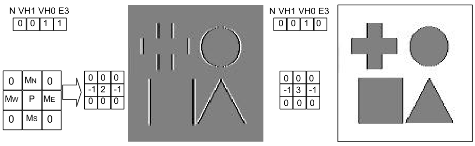
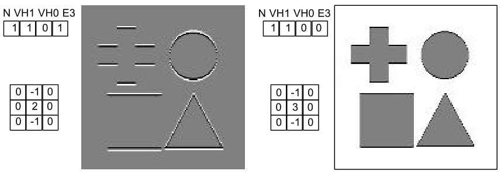
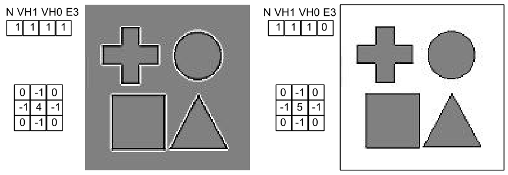
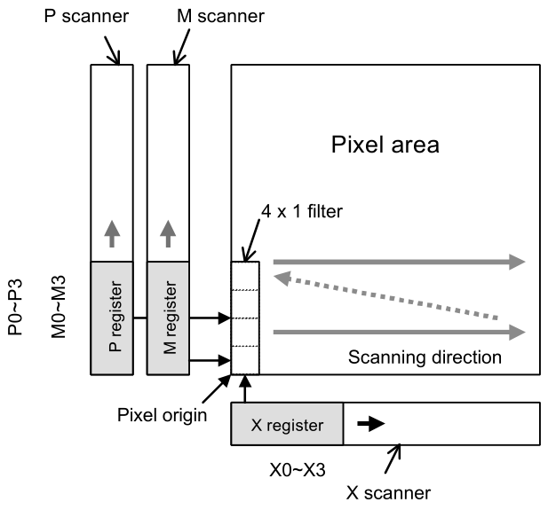
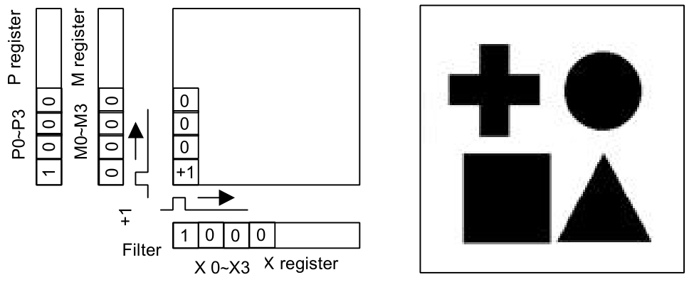
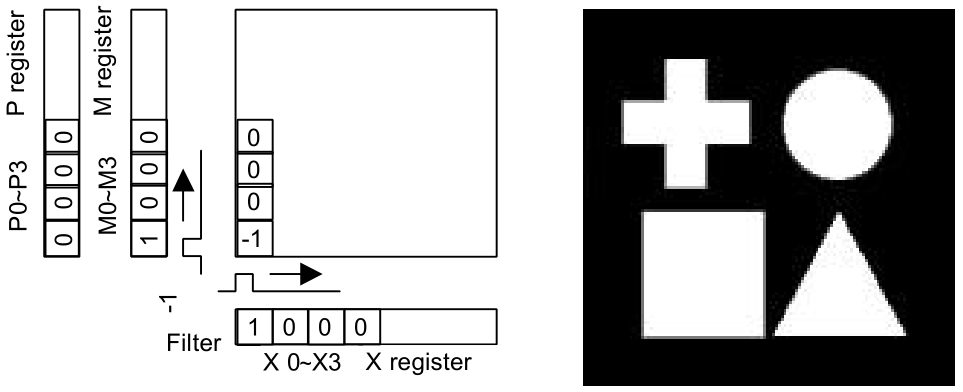
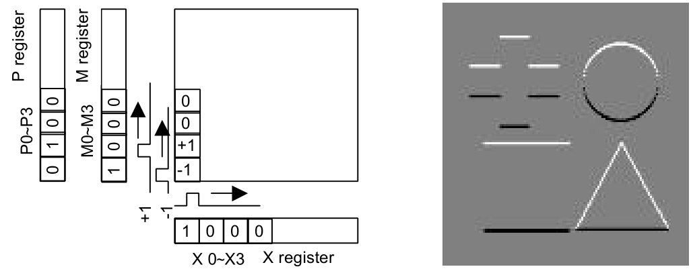

# Game Boy Camera

:::tip SOURCE

This section was originally compiled by Antonio Niño Díaz during his work on reverse engineering the Game Boy Camera. The upstream source can be found [here](https://github.com/AntonioND/gbcam-rev-engineer).

:::

## Camera Cartridge

The Game Boy Camera cartridge contains 4 ICs: the usual ROM and RAM ICs, a big controller IC (like a MBC) and a sensor (M64282FP "retina" chip).

The main board contains all ICs except from the sensor.

| Component# | Part#/inscription                    | Description          |
| ---------- | ------------------------------------ | -------------------- |
| U1         | MAC-GBD Nintendo 9807 SA             | I/O, memory control. |
| U2         | GBD-PCAX-0 F M538011-E - 08 8145507  | 1MB ROM              |
| U3         | 52CV1000SF85LL SHARP JAPAN 9805 5 0A | 128KB RAM            |

The U1 is the only one connected to the GB cartridge pins (besides some address pins of the ROM IC). The U2 and U3 (ROM and RAM) are connected to U1. The M64282FP "retina" chip is in a separate PCB, and is connected to the U1.
The M64282FP handles most of the configuration of the capturing process. The U1 transforms the commands from the Game Boy CPU into the correct signals needed for the M64282FP. The detailed timings are described below.
It is a good idea to have the datasheet of the M64282FP, but it is very poorly explained, so this document will try to explain everything about it (except from limits like voltage or signal timings). There are datasheets of similar sensors (M64283FP and M64285FP) that can be very useful to understand some things about the sensor of the GB Camera.

## Game Boy Camera MBC

The Game Boy Camera controller works pretty much the same as a MBC3.

### 0000-3FFF - ROM Bank 00 (Read Only)

First 16 KB of the ROM.

### 4000-7FFF - ROM Bank 01-3F (Read Only)

This area may contain any ROM bank (0 included). The initial mapped bank is 01.

<!-- #### A000-BFFF - RAM Bank 00-0F (Read/Write) -->

### A000-BFFF - CAM Registers (Read/Write)

Depending on the current RAM Bank Number, this memory space is used to access the cartridge RAM or the CAM registers. RAM can only be read if the capture unit is not working, it returns $00 otherwise.

### 0000-1FFF - RAM Enable (Write Only)

A value of $0A will enable writing to RAM, $00 will disable it. Reading from RAM or registers is always enabled. Writing to registers is always enabled. Disabled on reset.

### 2000-3FFF - ROM Bank Number (Write Only)

Writing a value of $00-$3F selects the corresponding ROM Bank for area 4000-7FFF.

### 4000-5FFF - RAM Bank Number/CAM Registers Select (Write Only)

Writing a value in range for $00-$0F maps the corresponding external RAM Bank to memory at A000-BFFF. Writing any value with bit 4 set to '1' will select CAM registers. Usually bank $10 is used to select the registers. All registers are mirrored every $80 bytes. RAM bank 0 selected on reset.

:::tip NOTE

Unlike most games, the GB Camera RAM can only be written when PHI pin = '1'. It's an enable signal for the RAM chip. Most cartridge readers and writers can't handle PHI pin, so they can't restore a saved backup. It isn't needed to change ROM banks.

:::

## I/O Registers

The Game Boy Camera I/O registers are mapped to all banks with bit 4 set to '1'. The GB Camera ROM usually changes to bank 16 ($10) to use the registers.

There are 3 groups of registers:

- The first group is composed by the trigger register A000. This register starts the capture process and returns the current status (working/capture finished).
- The second group is composed by registers A001-A005, used to configure most parameters of the M64282FP sensor.
- The third group is composed by 48 registers that form a 4×4 matrix. Each element of the matrix is formed by 3 bytes. This matrix is used by the controller for contrast and dithering.

All registers are write-only, except the register A000. The others return $00 when read. The initial values of all registers on reset is $00.

### Register A000

The lower 3 bits of this register can be read and write. The other bits return '0'. Writing any value with bit 0 set to '1' will start the capturing process. Any write with bit 0 set to '0' is a normal write and won't trigger the capture. The value of bits 1 and 2 affects the value written to registers 4, 5 and 6 of the M64282FP, which are used in 1-D filtering mode (effects described in following chapters).
Bit 0 of this register is also used to verify if the capturing process is finished. It returns '1' when the hardware is working and '0' if the capturing process is over.
When the capture process is active all RAM banks will return $00 when read (and writes are ignored), but the register A000 can still be read to know when the transfer is finished.
The capturing process can be stopped by writing a '0' to bit 0. When a '1' is written again it will continue the previous capture process with the old capture parameters, even if the registers are changed in between. If the process is stopped RAM can be read again.

### Register A001

This register is mapped to register 1 of M64282FP. It controls the output gain and the edge operation mode.

### Register A002, A003

These registers are mapped to registers 2 and 3 of M64282FP. They control the exposure time. Register 2 is the MSB, register 3 is the LSB.

```
u16 exposure_steps = [A003] | ([A002]<<8);
```

### Register A004

This register is mapped to register 7 of M64282FP. It sets the output voltage reference, the edge enhancement ratio, and it can invert the image.

### Register A005

This register is mapped to register 0 of M64282FP. It sets the output reference voltage and enables the zero point calibration.

### Register A006-A035

Those registers form a 4×4 matrix with 3 bytes per element. They handle dithering and contrast, and they are sorted by rows:

<table class="tg">
<thead>
  <tr>
    <th class="tg-0pky"></th>
    <th class="tg-0pky" colspan="4">X</th>
  </tr>
</thead>
<tbody>
  <tr>
    <td class="tg-0pky" rowspan="4">Y</td>
    <td class="tg-0pky">00</td>
    <td class="tg-0pky">10</td>
    <td class="tg-0lax">20</td>
    <td class="tg-0lax">30</td>
  </tr>
  <tr>
    <td class="tg-0pky">01</td>
    <td class="tg-0pky">11</td>
    <td class="tg-0lax">21</td>
    <td class="tg-0lax">31</td>
  </tr>
  <tr>
    <td class="tg-0pky">02</td>
    <td class="tg-0pky">12</td>
    <td class="tg-0lax">23</td>
    <td class="tg-0lax">33</td>
  </tr>
  <tr>
    <td class="tg-0lax">03</td>
    <td class="tg-0lax">13</td>
    <td class="tg-0lax">23</td>
    <td class="tg-0lax">33</td>
  </tr>
</tbody>
</table>

 <figure>
  
  <figcaption>Horizontal edge processing modes</figcaption>
</figure>

 <figure>
  
  <figcaption>Vertical edge processing modes.</figcaption>
</figure>

 <figure>
  
  <figcaption>2D edge processing modes.</figcaption>
</figure>

 <figure>
  
  <figcaption>1-D filtering hardware.</figcaption>
</figure>

 <figure>
  
  <figcaption>Positive image.</figcaption>
</figure>

 <figure>
  
  <figcaption>Negative image.</figcaption>
</figure>

 <figure>
  
  <figcaption>Edge extraction.</figcaption>
</figure>

## Game Boy Camera Timings

The capture process is started when the A000 register of the Game Boy Camera cartridge is written with any value with bit 0 set to "1".
The Game Boy Camera cartridge is one of the few cartridges that use the PHI signal (clock from the GB).
That signal is a 1 MiHz clock (1047567 Hz).
The M6438FP chip needs a clock input too, which is half the frequency of the PHI pin (0.5 Mihz, 524288Hz).
The reason for that is that the sensor chip sometimes handles the signals on the rising edge of the clock, but other times on the falling edge.

:::tip NOTE

This means that the GB Camera shouldn't be used in GBC double speed mode!

:::

The time needed to capture and process an image depends on the exposure time and the value of N bit of the register 1 of the M64282FP chip.
In GAME BOY CYCLES (1 MiHz):

```
N_bit    = ([A001] & BIT(7)) ? 0 : 512
exposure = ([A002]<<8) | [A003]
CYCLES   = 32446 + N_bit + 16 * exposure
```

Divide those values by 2 to get the sensor clocks.

### Capture process timings

The next values are in sensor clocks.
Multiply by 2 to get Game Boy cycles:

```
    - Reset pulse.
    - Configure sensor registers.     (11 × 8 CLKs)
    - Wait                                  (1 CLK)
    - Start pulse                           (1 CLK)
    - Exposure time       (exposure_steps × 8 CLKs)
    - Wait                                 (2 CLKs)
    - Read start
    - Read period        (N=1 ? 16128 : 16384 CLKs)
    - Read end
    - Wait                                 (3 CLKs)
    - Reset pulse to stop the sensor

    (88 + 1 + 1 + 2 + 16128 + 3 = 16223)

    CLKs = 16223 + ( N_bit ? 0 : 256 ) + 8 * exposure
```

Above is the previous result divided by 2.
During the read process, every pixel is written when it is read from the sensor.
If the read process is stopped, (by shutting the GB off, for example) the RAM will have contents of the current picture until the read was stopped.
From there, it will have the data from the image captured before that one.
The sensor transfers are 128×128 pixels, but the upper and lower rows are corrupted.
The Game Boy Camera controller uses the medium rows of the sensor image.
This means that it ignores the first 8 rows and the last 8 rows.

The clock signal during read period must be the same as the one used during the exposure time, but if the clock during the read period is too slow, the sensor will continue increasing the charge values of each pixel so the image will appear to be taken with a higher exposure time.
The brightness doesn't always seem to increase, however.
There appears to be some kind of limit.

## The Game Boy Camera sensor (M64282FP)

The M64282FP does some processing to the captured image.
First, it performs an edge control, then it does gain control, and lastly, it does level control.
The resulting analog value is the one that can be read in the V<sub>out</sub> pin.
The sensor can capture infrared radiation, so the images can be a bit strange compared to others captured by better sensors.

## The M64282FP registers

### Register 1

This corresponds to the register A001 of the Game Boy Camera.

When shooting, the values change based on how much light there is.

| Symbol | Bits | Operation                                         |
| ------ | ---- | ------------------------------------------------- |
| N      | 7    | Exclusively set vertical edge enhancement mode.   |
| VH     | 5-6  | Select vertical/horizontal edge enhancement mode. |
| G      | 0-4  | Analog output gain.                               |

<break><break>
<break><break>

| G3  | G2  | G1  | G0  | Gain |
| --- | --- | --- | --- | ---- |
| 0   | 0   | 0   | 1   | 14.0 |
| 0   | 0   | 0   | 1   | 15.5 |
| 0   | 0   | 1   | 0   | 17.0 |
| 0   | 0   | 1   | 1   | 18.5 |
| 0   | 1   | 0   | 0   | 20.0 |
| 0   | 1   | 0   | 1   | 21.5 |
| 0   | 1   | 1   | 0   | 23.0 |
| 0   | 1   | 1   | 1   | 24.5 |
| 1   | 0   | 0   | 0   | 26.0 |
| 1   | 0   | 0   | 1   | 29.0 |
| 1   | 0   | 1   | 0   | 32.0 |
| 1   | 0   | 1   | 1   | 35.0 |
| 1   | 1   | 0   | 0   | 38.0 |
| 1   | 1   | 0   | 1   | 41.0 |
| 1   | 1   | 1   | 0   | 45.5 |
| 1   | 1   | 1   | 1   | 51.5 |

If G4 = "1", the total gain is the previous one plus 6 dB.
The Game Boy Camera uses $00, $04, $08, and $0A at 14 dB, 20 dB, 26 dB, and 32 dB respectively, which translate to a gain of 5.01, 10.00, 19.95, and 39.81.
The Game Boy Camera seems to like to duplicate the game in each step.

## Registers 2 and 3

Registers 2 and 3 contain the exposure time (a 16 bit unsigned value).
According to the M64282FP datasheet, each step is 16 µs.
The GB needs 16 PHI clocks for every step.
However, if N = "1", `exposure_steps` should be greater than or equal to $0030.

```
    u16 exposure_steps ((Reg2)<<8) | [Reg3]
    Step time = 1 / 1048576 Hz * 16 = 0,954 µs * 16 = 15,259 µs
```

It's a bit less than the 16 µs the datasheet says, but it's close enough.

Below are some example values to get acceptable pictures under various light conditions:

| Value | Conditions                                         |
| ----- | -------------------------------------------------- |
| $0030 | Objects under direct sunlight.                     |
| $0300 | Objects not under direct sunlight.                 |
| $0800 | Room during the day with good light.               |
| $2C00 | Room at night with no light.                       |
| $5000 | Room at night with no light, only a reading lamp . |
| $F000 | Room at night with only a TV on in the background. |

## Sample code for emulators

The following code is used to convert a greyscale image to the Game Boy Camera format. `GB_CameraTakePicture()` should be called when bit 0 of A000 register is st to '1'. The emulator should wait CAM_CLOCKS_LEFT until the bit 0 is cleared. The gain and level control are not needed to emulate the Game Boy Camera because webcams do that automatically. In fact, trying to emulate that will probably break the image. The code is not very clean because it has been extracted from [GiiBiiAdvance](https://github.com/AntonioND/giibiiadvance), but it seems to handle all used configurations of edge handling.

Note that the actual Game Boy Camera sensor is affected by infrared so the emulation can't be perfect anyway. A good way of converting a RGB image into grayscale is to do:

```c

//--------------------------------------------------------------------

// The actual sensor image is 128x126 or so.
#define GBCAM_SENSOR_EXTRA_LINES (8)
#define GBCAM_SENSOR_W (128)
#define GBCAM_SENSOR_H (112+GBCAM_SENSOR_EXTRA_LINES)

#define GBCAM_W (128)
#define GBCAM_H (112)

#define BIT(n) (1<<(n))

// Webcam image
static int gb_camera_webcam_output[GBCAM_SENSOR_W][GBCAM_SENSOR_H];
// Image processed by sensor chip
static int gb_cam_retina_output_buf[GBCAM_SENSOR_W][GBCAM_SENSOR_H];

//--------------------------------------------------------------------

static inline int clamp(int min, int value, int max)
{
    if(value < min) return min;
    if(value > max) return max;
    return value;
}

static inline int min(int a, int b) { return (a < b) ? a : b; }

static inline int max(int a, int b) { return (a > b) ? a : b; }

//--------------------------------------------------------------------

static inline u32 gb_cam_matrix_process(u32 value, u32 x, u32 y)
{
    x = x & 3;
    y = y & 3;

    int base = 6 + (y*4 + x) * 3;

    u32 r0 = CAM_REG[base+0];
    u32 r1 = CAM_REG[base+1];
    u32 r2 = CAM_REG[base+2];

    if(value < r0) return 0x00;
    else if(value < r1) return 0x40;
    else if(value < r2) return 0x80;
    return 0xC0;
}

static void GB_CameraTakePicture(void)
{
    int i, j;

    //------------------------------------------------

    // Get webcam image
    // ----------------

    GB_CameraWebcamCapture();

    //------------------------------------------------

    // Get configuration
    // -----------------

    // Register 0
    u32 P_bits = 0;
    u32 M_bits = 0;

    switch( (CAM_REG[0]>>1)&3 )
    {
        case 0: P_bits = 0x00; M_bits = 0x01; break;
        case 1: P_bits = 0x01; M_bits = 0x00; break;
        case 2: case 3: P_bits = 0x01; M_bits = 0x02; break;
        default: break;
    }

    // Register 1
    u32 N_bit = (CAM_REG[1] & BIT(7)) >> 7;
    u32 VH_bits = (CAM_REG[1] & (BIT(6)|BIT(5))) >> 5;

    // Registers 2 and 3
    u32 EXPOSURE_bits = CAM_REG[3] | (CAM_REG[2]<<8);

    // Register 4
    const float edge_ratio_lut[8] = { 0.50, 0.75, 1.00, 1.25, 2.00, 3.00, 4.00, 5.00 };

    float EDGE_alpha = edge_ratio_lut[(CAM_REG[4] & 0x70)>>4];

    u32 E3_bit = (CAM_REG[4] & BIT(7)) >> 7;
    u32 I_bit = (CAM_REG[4] & BIT(3)) >> 3;

    //------------------------------------------------

    // Calculate timings
    // -----------------

    CAM_CLOCKS_LEFT = 4 * ( 32446 + ( N_bit ? 0 : 512 ) + 16 * EXPOSURE_bits );

    //------------------------------------------------

    // Sensor handling
    // ---------------

    //Copy webcam buffer to sensor buffer applying color correction and exposure time
    for(i = 0; i < GBCAM_SENSOR_W; i++) for(j = 0; j < GBCAM_SENSOR_H; j++)
    {
        int value = gb_camera_webcam_output[i][j];
        value = ( (value * EXPOSURE_bits ) / 0x0300 ); // 0x0300 could be other values
        value = 128 + (((value-128) * 1)/8); // "adapt" to "3.1"/5.0 V
        gb_cam_retina_output_buf[i][j] = gb_clamp_int(0,value,255);
    }

    if(I_bit) // Invert image
    {
        for(i = 0; i < GBCAM_SENSOR_W; i++) for(j = 0; j < GBCAM_SENSOR_H; j++)
        {
            gb_cam_retina_output_buf[i][j] = 255-gb_cam_retina_output_buf[i][j];
        }
    }

    // Make signed
    for(i = 0; i < GBCAM_SENSOR_W; i++) for(j = 0; j < GBCAM_SENSOR_H; j++)
    {
        gb_cam_retina_output_buf[i][j] = gb_cam_retina_output_buf[i][j]-128;
    }

    int temp_buf[GBCAM_SENSOR_W][GBCAM_SENSOR_H];

    u32 filtering_mode = (N_bit<<3) | (VH_bits<<1) | E3_bit;
    switch(filtering_mode)
    {
        case 0x0: // 1-D filtering
        {
            for(i = 0; i < GBCAM_SENSOR_W; i++) for(j = 0; j < GBCAM_SENSOR_H; j++)
            {
                temp_buf[i][j] = gb_cam_retina_output_buf[i][j];
            }
            for(i = 0; i < GBCAM_SENSOR_W; i++) for(j = 0; j < GBCAM_SENSOR_H; j++)
            {
                int ms = temp_buf[i][gb_min_int(j+1,GBCAM_SENSOR_H-1)];
                int px = temp_buf[i][j];

                int value = 0;
                if(P_bits&BIT(0)) value += px;
                if(P_bits&BIT(1)) value += ms;
                if(M_bits&BIT(0)) value -= px;
                if(M_bits&BIT(1)) value -= ms;
                gb_cam_retina_output_buf[i][j] = gb_clamp_int(-128,value,127);
            }
            break;
        }
        case 0x2: //1-D filtering + Horiz. enhancement : P + {2P-(MW+ME)} * alpha
        {
            for(i = 0; i < GBCAM_SENSOR_W; i++) for(j = 0; j < GBCAM_SENSOR_H; j++)
            {
                int mw = gb_cam_retina_output_buf[gb_max_int(0,i-1)][j];
                int me = gb_cam_retina_output_buf[gb_min_int(i+1,GBCAM_SENSOR_W-1)][j];
                int px = gb_cam_retina_output_buf[i][j];

                temp_buf[i][j] = gb_clamp_int(0,px+((2*px-mw-me)*EDGE_alpha),255);
            }
            for(i = 0; i < GBCAM_SENSOR_W; i++) for(j = 0; j < GBCAM_SENSOR_H; j++)
            {
                int ms = temp_buf[i][gb_min_int(j+1,GBCAM_SENSOR_H-1)];
                int px = temp_buf[i][j];

                int value = 0;
                if(P_bits&BIT(0)) value += px;
                if(P_bits&BIT(1)) value += ms;
                if(M_bits&BIT(0)) value -= px;
                if(M_bits&BIT(1)) value -= ms;
                gb_cam_retina_output_buf[i][j] = gb_clamp_int(-128,value,127);
            }
            break;
        }
        case 0xE: //2D enhancement : P + {4P-(MN+MS+ME+MW)} * alpha
        {
            for(i = 0; i < GBCAM_SENSOR_W; i++) for(j = 0; j < GBCAM_SENSOR_H; j++)
            {
                int ms = gb_cam_retina_output_buf[i][gb_min_int(j+1,GBCAM_SENSOR_H-1)];
                int mn = gb_cam_retina_output_buf[i][gb_max_int(0,j-1)];
                int mw = gb_cam_retina_output_buf[gb_max_int(0,i-1)][j];
                int me = gb_cam_retina_output_buf[gb_min_int(i+1,GBCAM_SENSOR_W-1)][j];
                int px  = gb_cam_retina_output_buf[i][j];

                temp_buf[i][j] = gb_clamp_int(-128,px+((4*px-mw-me-mn-ms)*EDGE_alpha),127);
            }
            for(i = 0; i < GBCAM_SENSOR_W; i++) for(j = 0; j < GBCAM_SENSOR_H; j++)
            {
                gb_cam_retina_output_buf[i][j] = temp_buf[i][j];
            }
            break;
        }
        case 0x1:
        {
            // In my GB Camera cartridge this is always the same color. The datasheet of the
            // sensor doesn't have this configuration documented. Maybe this is a bug?
            for(i = 0; i < GBCAM_SENSOR_W; i++) for(j = 0; j < GBCAM_SENSOR_H; j++)
            {
                gb_cam_retina_output_buf[i][j] = 0;
            }
            break;
        }
        default:
        {
            // Ignore filtering
            printf("Unsupported GB Cam mode: 0x%X\n"
                   "%02X %02X %02X %02X %02X %02X",
                   filtering_mode,
                   CAM_REG[0],CAM_REG[1],CAM_REG[2],
                   CAM_REG[3],CAM_REG[4],CAM_REG[5]);
            break;
        }
    }

  // Make unsigned
    for(i = 0; i < GBCAM_SENSOR_W; i++) for(j = 0; j < GBCAM_SENSOR_H; j++)
    {
        gb_cam_retina_output_buf[i][j] = gb_cam_retina_output_buf[i][j]+128;
    }

    //------------------------------------------------

    // Controller handling
    // -------------------

    int fourcolorsbuffer[GBCAM_W][GBCAM_H]; // buffer after controller matrix

    // Convert to Game Boy colors using the controller matrix
    for(i = 0; i < GBCAM_W; i++) for(j = 0; j < GBCAM_H; j++)
        fourcolorsbuffer[i][j] =
            gb_cam_matrix_process(
                gb_cam_retina_output_buf[i][j+(GBCAM_SENSOR_EXTRA_LINES/2)],i,j);

    // Convert to tiles
    u8 finalbuffer[14][16][16]; // final buffer
    memset(finalbuffer,0,sizeof(finalbuffer));
    for(i = 0; i < GBCAM_W; i++) for(j = 0; j < GBCAM_H; j++)
    {
        u8 outcolor = 3 - (fourcolorsbuffer[i][j] >> 6);

        u8 * tile_base = finalbuffer[j>>3][i>>3];
        tile_base = &tile_base[(j&7)*2];

        if(outcolor & 1) tile_base[0] |= 1<<(7-(7&i));
        if(outcolor & 2) tile_base[1] |= 1<<(7-(7&i));
    }

    // Copy to cart ram...
    memcpy(&(SRAM[0][0x0100]),finalbuffer,sizeof(finalbuffer));
}

//--------------------------------------------------------------------
```
