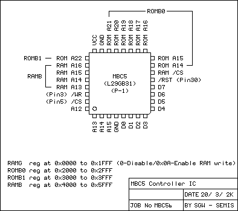

# MBC5

It can map up to 64 Mbits (8 MiB) of ROM.

MBC5 (Memory Bank Controller 5) is the 4th generation MBC. There
apparently was no MBC4, presumably because of the superstition about the
number 4 in Japanese culture. It is the first MBC that is guaranteed to
work properly with GBC double speed mode.

## Memory

### 0000-3FFF - ROM Bank 00 (Read Only)

Contains the first 16 KiB of the ROM.

### 4000-7FFF - ROM bank 00-1FF (Read Only)

Same as for MBC1, except that accessing up to bank $1FF is supported
now. Also, bank 0 is actually bank 0.

### A000-BFFF - RAM bank 00-0F, if any (Read/Write)

Same as for MBC1, except that RAM sizes are 8 KiB, 32 KiB and 128 KiB.

## Registers

### 0000-1FFF - RAM Enable (Write Only)

Mostly the same as for MBC1. Writing $0A will enable reading and
writing to external RAM. Writing $00 will disable it.

Actual MBCs actually enable RAM when writing any value whose bottom 4 bits equal $A (so $0A, $1A, and so on), and disable it when writing anything else.
Relying on this behavior is not recommended for compatibility reasons.

### 2000-2FFF - 8 least significant bits of ROM bank number (Write Only)

The 8 least significant bits of the ROM bank number go here. Writing 0 will indeed
give bank 0 on MBC5, unlike other MBCs.

### 3000-3FFF - 9th bit of ROM bank number (Write Only)

The 9th bit of the ROM bank number goes here.

### 4000-5FFF - RAM bank number (Write Only)

As for the MBC1s RAM Banking Mode, writing a value in the range $00-$0F
maps the corresponding external RAM bank (if any) into the memory area at
A000-BFFF.

### Rumble

On cartridges which feature a rumble motor, bit 3 of the RAM Bank register
is connected to the Rumble circuitry instead of the RAM chip. Setting the
bit to 1 enables the rumble motor and keeps it enabled until the bit is reset again.

To control the rumble's intensity, it should be turned on and off repeatedly,
as seen with these two examples from Pokémon Pinball:

