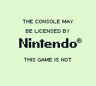

# Power-Up Sequence

When the Game Boy is powered up, the CPU actually does not start executing instructions at $0100, but actually at $0000.
A program called the *boot ROM*, burned inside the CPU, is mapped "over" the cartridge ROM at first.
This program is responsible for the boot-up animation played before control is handed over to the cartridge's ROM.
Since the boot ROM hands off control to the game ROM at address $0100, and developers typically need not care about the boot ROM, the "start address" is usually documented as $0100 and not $0000.

9 different known official boot ROMs are known to exist:

Name | Size (bytes) | Notes
-----|--------------|------------------------------------------------------------
DMG0 | 256          | Blinks on failed checks, no ®
DMG  | 256          | |
MGB  | 256          | One-byte difference to DMG
SGB  | 256          | Only forwards logo to SGB BIOS, performs no checks
SGB2 | 256          | Same difference to SGB than between MGB and DMG
CGB0 | 256 + 1792   | Does not init [wave RAM](<#FF30–FF3F — Wave pattern RAM>)
CGB  | 256 + 1792   | Split in two parts, with the cartridge header in the middle
AGB0 | 256 + 1792   | Increments B register for GBA identification
AGB  | 256 + 1792   | Fixes ["logo TOCTTOU"](<#Bypass>)

[A disassembly of all of them is available online.](https://github.com/ISSOtm/gb-bootroms)

## Monochrome models (DMG0, DMG, MGB)

The monochrome boot ROMs read [the logo from the header](<#0104-0133 — Nintendo logo>), unpack it into VRAM, and then start slowly scrolling it down.
Since reads from an absent cartridge usually return $FF, this explains why powering the console on without a cartridge scrolls a black box.
Additionally, fauly or dirty connections can cause the data read to be corrupted, resulting in a jumbled-up logo.

*Once the logo has finished scrolling*, the boot ROM plays the famous "ba-ding!" sound, and reads the logo **again**, this time comparing it to a copy it stores.
Then, it also computes the header checksum, and compares it to [the checksum stored in the header](<#014D — Header checksum>).
If either of these checks fail, the boot ROM **locks up**, and control is never passed to the cartridge ROM.

Finally, the boot ROM writes to the `BANK` register at $FF50, which unmaps the boot ROM.
The `ldh [$FF50], a` instruction being located at $00FE (and being two bytes long), [the first instruction executed from the cartridge ROM is at $0100](<#0100-0103 — Entry point>).

Since the A register is used to write to $FF50, its value is passed to the cartridge ROM; the only difference between the DMG and MGB boot ROMs is that the former writes $01, and the latter uses $FF.

### DMG0

The DMG0 is a rare "early bird" variant of the DMG boot ROM present in few early DMGs.
The behavior of the boot ROM is globally the same, but significant portions of the code have been rearranged.

Interestingly, the DMG0 boot ROM performs both the logo and checksum checks before displaying anything.
If either verification fails, the screen is made to blink while the boot ROM locks up, alternating between solid white and solid black.

The DMG0 boot ROM also lacks the ® symbol next to the Nintendo logo.

## Super Game Boy (SGB, SGB2)

These boot ROMs are fairly unique in that they do *not* perform header checks.
Instead, they set up the Nintendo logo in VRAM from the header just like the monochrome boot ROMs, but then they send the entire header to the SGB BIOS via [the standard packet-transferring procedure](<#Command Packet Transfers>), using packet header bytes $F1, $F3, $F5, $F7, $F9, and $FB, in that order.
(These packet IDs are otherwise invalid and never used in regular SGB operation, though it seems that not all SGB BIOS revisions filter them out.)

The boot ROM then unmaps itself and hands off execution to the cartridge ROM without performing any checks.
The SGB BIOS, the program running on the SNES, actually verifies the Nintendo logo and header checksum itself.
If either verification fails, the BIOS itself locks up, repeatedly resetting the SGB CPU within the cartridge.

As the DMG and MGB boot ROMs, the SGB and SGB2 boot ROMs write $01 and $FF respectively to $FF50, and this is also the only difference between these two boot ROMs.

The way the packet-sending routine works makes transferring a set bit *one cycle* faster than transferring a reset bit; this means that the time taken by the SGB boot ROMs *depends on the cartridge's header*.
The relationship between the header and the time taken is made more complex by the fact that the boot ROM waits for 4 VBlanks after transferring each packet, mostly but not entirely grouping the timings.

## Color models (CGB0, CGB, AGB0, AGB)

The color boot ROMs are much more complicated, notably because of the compatibility behavior.

### Size

The boot ROM is larger, as indicated in the table at the top: 2048 bytes total.
It still has to be mapped starting at $0000, since this is where the CPU starts, but it must also access the cartridge header at $0100-014F.
Thus, the boot ROM is actually split in two parts, a $0000-00FF one, and a $0200-08FF one.

### Behavior

First, the boot ROMs unpack the Nintendo logo to VRAM like the monochrome models, likely for compatibility, and copies the logo to a buffer in HRAM at the same time.
(It is speculated that HRAM was used due to it being embedded within the CPU, unlike WRAM, so that it couldn't be tampered with.)

Then, the logo is read and decompressed *again*, but with no resizing, yielding the much smaller logo placed below the big "GAME BOY" one.
The boot ROM then sets up compatibility palettes, as described further below, and plays the logo animation with the "ba-ding!" sound.

During the logo animation, and if bit 7 of [the CGB compatibility byte](<#0143 — CGB flag>) is reset (indicating a monochrome-only game), the user is allowed to pick a palette to override the one chosen for compatibility.
Each new choice prevents the animation from ending for 30 frames, potentially delaying the checks and fade-out.

Then, like the monochrome boot ROMs, the header logo is checked *from the buffer in HRAM*, and the header checksum is verified.
For unknown reasons, however, only the first half of the logo is checked, despite the full logo being present in the HRAM buffer.

Finally, the boot ROM fades all BG palettes to white, and sets the hardware to compatibility mode.
If [the CGB compatibility byte](<#0143 — CGB flag>) indicates CGB compatibility, the byte is written directly to [`KEY0`](<#FF4C — KEY0 (CGB Mode only): CPU mode select>), potentially [enabling "PGB mode"](<#PGB mode>);
otherwise, $04 is written to [`KEY0`](<#FF4C — KEY0 (CGB Mode only): CPU mode select>) (enabling DMG compatibility mode in the CPU),
$01 is written to [`OPRI`](<#FF6C — OPRI (CGB Mode only): Object priority mode>) (enabling [DMG OBJ priority](<#Object Priority and Conflicts>)), and the [compatibility palettes](<#Compatibility palettes>) are written.
Additionally, the DMG logo tilemap is written [if the compatibility requests it](<#Compatibility palettes>).

Like all other boot ROMs, the last thing the color boot ROMs do is hand off execution at the same time as they unmap themselves, though they write $11 instead of $01 or $FF.

### CGB0

Like the DMG0 boot ROM, some early CGBs contain a different boot ROM.
Unlike DMG0 and DMG, the differences between the CGB0 and CGB boot ROM are very minor, with no change in the layout of the ROM.

The most notable change is that the CGB0 boot ROM does *not* init [wave RAM](<#FF30–FF3F — Wave pattern RAM>).
This is known to cause, for example, a different title screen music in the game *R-Type*.

The CGB0 boot ROM also writes copies of other variables to some locations in WRAM that are not otherwise read anywhere.
It is speculated that this may be debug remnants.

### Compatibility palettes

The boot ROM is responsible for the automatic colorization of monochrome-only games when run on a GBC.

When in DMG compatibility mode, the [CGB palettes](<#LCD Color Palettes (CGB only)>) are still being used: the background uses BG palette 0 (likely because the entire [attribute map](<#BG Map Attributes (CGB Mode only)>) is set to all zeros), and objects use OBJ palette 0 or 1 depending on bit 4 of [their attribute](<#Byte 3 — Attributes/Flags>).
[`BGP`, `OBP0`, and `OBP1`](<#LCD Monochrome Palettes>) actually index into the CGB palettes instead of the DMG's shades of grey.

The boot ROM picks a compatibility palette using an ID computed using the following algorithm:
1. Check if the [old licensee code](<#014B — Old licensee code>) is $33.
   * If yes, the [new licensee code](<#0144–0145 — New licensee code>) must be used. Check that it equals the ASCII string `"01"`.
   * If not, check that it equals $01.

   
In effect, this checks that the licensee in the header is Nintendo.

   * If this check fails, palettes ID $00 is used.
   * Otherwise, the algorithm proceeds.
1. Compute the sum of all 16 [game title](<#0134-0143 — Title>) bytes, storing this as the "title checksum".
1. Find the title checksum [in a table](https://github.com/ISSOtm/gb-bootroms/blob/443d7f057ae06e8d1d76fa8083650cf0be2cd0ae/src/cgb.asm#L1221-L1230), and record its index within the table.

   An almost-complete list of titles corresponding to the different checksums can be found in [Liji's free CGB boot ROM reimplementation](https://github.com/LIJI32/SameBoy/blob/1d7692cff5552e296be5e1ab075c4f187f57132c/BootROMs/cgb_boot.asm#L230-L328).
   * If not found, palettes ID $00 is used.
   * If the index is 64 or below, the index is used as-is as the palettes ID, and the algorithm ends.
   * Otherwise, it must be further corrected based on the title's fourth letter; proceed to the step below.
1. The fourth letter is searched for in [another table](https://github.com/ISSOtm/gb-bootroms/blob/443d7f057ae06e8d1d76fa8083650cf0be2cd0ae/src/cgb.asm#L1232-L1240).
   * If the letter can't be found, palettes ID $00 is used.
   * If the letter is found, the index obtained in the previous step is increased by 14 times the row index to get the palettes ID.
     (So, if the letter was found in the first row, the index is unchanged; if it's found in the second row, it's increased by 14, and so on.)

The resulting palettes ID is used to pick 3 palettes out of a table via a fairly complex mechanism.
The user can override this choice using certain button combinations during the logo animation; some of these manual choices are identical to auto-colorizations, [but others are unique](https://tcrf.net/Notes:Game_Boy_Color_Bootstrap_ROM#Manual_Select_Palette_Configurations).

:::tip Available palettes

A table of checksums (and tie-breaker fourth letters when applicable) and the corresponding palettes can be found [on TCRF](https://tcrf.net/Notes:Game_Boy_Color_Bootstrap_ROM#Assigned_Palette_Configurations).

:::

If the ID is either $43 or $58, then the Nintendo logo's tilemap is written to VRAM.
This is intended for games that perform some kind of animation with the Nintendo logo; it suddenly appears in the middle of the screen, though, so it may look better for homebrew not to use this mechanism.

### Scrapped palette switching menu

Remnants of a functionality designed to allow switching the CGB palettes while the game is running exist in the CGB CPU.

## Stadium 2

Pokémon Stadium 2's "GB Tower" emulator contains a very peculiar boot ROM.
It can be found at offset $015995F0 in the US release, and is only 1008 bytes long.
Its purpose is unknown.

This boot ROM does roughly the same setup as a regular CGB boot ROM, but writes to $FF50 very early, and said write is followed by a lock-up loop.
Further, the boot ROM contains a valid header, which is mostly blank save for the logo, compatibility flag (which indicates dual compatibility), and header checksum.

## Logo check

While it may make sense for the boot ROM to at least partially verify the ROM's integrity via the header check, one may wonder why the logo is checked more stringently.

### Legal implications

:::danger Caution

The following is advisory, but **is not legal advice**.
If necessary (e.g. commercial releases with logos on the boxes), consult a lawyer.

:::

The logo check was meant to deter piracy using trademark law.
Unlike nowadays, the Game Boy's technology was not sufficient to require Nintendo's approval to make a game run on it, and Nintendo decided against hardware protection like the NES' [lockout chip](https://wiki.nesdev.org/w/index.php/CIC_lockout_chip) likely for cost and/or power consumption reasons.

Instead, the boot ROM's logo check forces each ROM intended to run on the system to contain an (encoded) copy of the Nintendo logo, which is displayed on startup.
Nintendo's strategy was to threaten pirate developers with suing for trademark infringement.

Fortunately, [*Sega v. Accolade*](https://en.wikipedia.org/wiki/Sega_v._Accolade) ruled (in the US) that use of a trademarked logo is okay if it is *necessary* for running programs on the console, so there is no danger for homebrew developers.

That said, if you want to explicitly mark the lack of licensing from Nintendo, you can add some text to the logo screen once the boot ROM hands off control, for example like this:

### Bypass

The Nintendo logo check has been [circumvented many times](http://fuji.drillspirits.net/?post=87), be it to avoid legal action from Nintendo or for the swag, and there are basically two ways of doing so.

One is to exploit a [TOCTTOU](https://en.wikipedia.org/wiki/TOCTTOU) vulnerability in the way the console reads the logo (doing so once to draw it, and the other time to check it), which has however been patched on later revisons of the AGB.
This requires custom hardware in the cartridge, however, and is made difficult by the timing and order of the reads varying greatly between boot ROMs.
Some implementations use a custom mapper, others use a capacitor holding some of the address lines to redirect reads to a separate region of ROM containing the modified logo.

The other way is Game Boy Color (and Advance) exclusive: for some reason, the boot ROM copies the full logo into HRAM, but only compares the first half.
Thus, a logo whose top half is correct but not the bottom half will get a pass from the CGB boot ROM.
Strangely, despite correcting the TOCTTOU vulnerability in its later revision, the CGB-AGB boot ROM does *not* fix this mistake.

## Console state after boot ROM hand-off

Regardless of the console you intend for your game to run on, it is prudent to rely on as little of the following as possible, barring what is mentioned elsewhere in this documentation to detect which system you are running on.
This ensures maximum compatibility, both across consoles and cartridges (especially flashcarts, which typically run their own menu code before your game), increases reliability, and is generally considered good practice.

:::warning Use it at your own risk

Some of the information below is highly volatile, due to the complexity of some of the boot ROM behaviors; thus, some of it may contain errors.
Rely on it at your own risk.

:::

### Common remarks

The console's WRAM and HRAM are random on power-up.
[Different models tend to exhibit different patterns](https://web.archive.org/web/20220131221108/https://twitter.com/CasualPkPlayer/status/1409752977812852736), but they are random nonetheless, even depending on factors such as the ambient temperature.
Besides, turning the system off and on again has proven reliable enough [to carry over RAM from one game to another](https://www.youtube.com/watch?v=xayxmTLljr8), so it's not a good idea to rely on it at all.

Emulation of uninitialized RAM is inconsistent: some emulators fill RAM with a constant on startup (typically $00 or $FF), some emulators fully randomize RAM, and others attempt to reproduce the patterns observed on hardware.
It is a good idea to enable your favorite emulator's "break on uninitialized RAM read" exception (and if it doesn't have one, to consider using an emulator that does).

While technically not related to power-on, it is worth noting that external RAM in the cartridge, when present, usually contains random garbage data when first powered on.
It is strongly advised for the game to put a large enough known sequence of bytes at a fixed location in SRAM, and check its presence before accessing any saved data.

### CPU registers

Register | DMG0            | DMG                     | MGB                     | SGB             | SGB2
--------:|:---------------:|:-----------------------:|:-----------------------:|:---------------:|:---------------:
**A**    | $01             | $01                     | $FF                     | $01             | $FF
**F**    | Z=0 N=0 H=0 C=0 | Z=1 N=0 H=? C=?[^dmg_c] | Z=1 N=0 H=? C=?[^dmg_c] | Z=0 N=0 H=0 C=0 | Z=0 N=0 H=0 C=0
**B**    | $FF             | $00                     | $00                     | $00             | $00
**C**    | $13             | $13                     | $13                     | $14             | $14
**D**    | $00             | $00                     | $00                     | $00             | $00
**E**    | $C1             | $D8                     | $D8                     | $00             | $00
**H**    | $84             | $01                     | $01                     | $C0             | $C0
**L**    | $03             | $4D                     | $4D                     | $60             | $60
**PC**   | $0100           | $0100                   | $0100                   | $0100           | $0100
**SP**   | $FFFE           | $FFFE                   | $FFFE                   | $FFFE           | $FFFE

[^dmg_c]:
If the [header checksum](<#014D — Header checksum>) is $00, then the carry and half-carry flags are clear; otherwise, they are both set.

Register | CGB (DMG mode)  | AGB (DMG mode)             | CGB             | AGB
--------:|:---------------:|:--------------------------:|:---------------:|:---------------:
**A**    | $11             | $11                        | $11             | $11
**F**    | Z=1 N=0 H=0 C=0 | Z=? N=0 H=? C=0[^agbdmg_f] | Z=1 N=0 H=0 C=0 | Z=0 N=0 H=0 C=0
**B**    | ??[^cgbdmg_b]   | ??[^cgbdmg_b] + 1          | $00             | $01
**C**    | $00             | $00                        | $00             | $00
**D**    | $00             | $00                        | $FF             | $FF
**E**    | $08             | $08                        | $56             | $56
**H**    | $??[^cgbdmg_hl] | $??[^cgbdmg_hl]            | $00             | $00
**L**    | $??[^cgbdmg_hl] | $??[^cgbdmg_hl]            | $0D             | $0D
**PC**   | $0100           | $0100                      | $0100           | $0100
**SP**   | $FFFE           | $FFFE                      | $FFFE           | $FFFE

[^agbdmg_f]:
To determine the flags, take the B register you would have gotten on CGB[^cgbdmg_b], and `inc` it.
(To be precise: an `inc b` is the last operation to touch the flags.)
The carry and direction flags are always clear, though.

[^cgbdmg_b]:
If the [old licensee code](<#014B — Old licensee code>) is $01, or the old licensee code is $33 and the [new licensee code](<#0144–0145 — New licensee code>) is `"01"` ($30 $31), then B is the sum of all 16 [title](<#0134-0143 — Title>) bytes.
Otherwise, B is $00.
As indicated by the "+ 1" in the "AGB (DMG mode)" column, if on AGB, that value is increased by 1[^agbdmg_f].

[^cgbdmg_hl]: There are two possible cases:
              - **The B register is $43 or $58 (on CGB) / $44 or $59 (on AGB)**: HL = $991A
              - **Neither of the above**: HL = $007C

<!-- How else do I prevent the footnote definition from being too greedy? >_< -->

The tables above were obtained from analysis of [the boot ROM's disassemblies](https://github.com/ISSOtm/gb-bootroms), and confirmed using Mooneye-GB tests [`acceptance/boot_regs-dmg0`](https://github.com/Gekkio/mooneye-gb/blob/ca7ff30b52fd3de4f1527397f27a729ffd848dfa/tests/acceptance/boot_regs-dmg0.s), [`acceptance/boot_regs-dmgABC`](https://github.com/Gekkio/mooneye-gb/blob/ca7ff30b52fd3de4f1527397f27a729ffd848dfa/tests/acceptance/boot_regs-dmgABC.s), [`acceptance/boot_regs-mgb`](https://github.com/Gekkio/mooneye-gb/blob/ca7ff30b52fd3de4f1527397f27a729ffd848dfa/tests/acceptance/boot_regs-mgb.s), [`acceptance/boot_regs-sgb`](https://github.com/Gekkio/mooneye-gb/blob/ca7ff30b52fd3de4f1527397f27a729ffd848dfa/tests/acceptance/boot_regs-sgb.s), [`acceptance/boot_regs-sgb2`](https://github.com/Gekkio/mooneye-gb/blob/ca7ff30b52fd3de4f1527397f27a729ffd848dfa/tests/acceptance/boot_regs-sgb2.s), [`misc/boot_regs-cgb`](https://github.com/Gekkio/mooneye-gb/blob/ca7ff30b52fd3de4f1527397f27a729ffd848dfa/tests/misc/boot_regs-cgb.s), and [`misc/boot_regs-A`](https://github.com/Gekkio/mooneye-gb/blob/ca7ff30b52fd3de4f1527397f27a729ffd848dfa/tests/misc/boot_regs-A.s), plus some extra testing.

## Hardware registers

As far as timing-sensitive values are concerned, these values are recorded at PC = $0100.

Name          | Address | DMG0     | DMG / MGB | SGB / SGB2 | CGB / AGB
-------------:|:-------:|:--------:|:---------:|:----------:|:-----------:
[`P1`]        | $FF00   | $CF      | $CF       | $C7 or $CF | $C7 or $CF
[`SB`]        | $FF01   | $00      | $00       | $00        | $00
[`SC`]        | $FF02   | $7E      | $7E       | $7E        | $7F
[`DIV`]       | $FF04   | $18      | $AB       | ??[^unk]   | ??[^unk_pad]
[`TIMA`]      | $FF05   | $00      | $00       | $00        | $00
[`TMA`]       | $FF06   | $00      | $00       | $00        | $00
[`TAC`]       | $FF07   | $F8      | $F8       | $F8        | $F8
[`IF`]        | $FF0F   | $E1      | $E1       | $E1        | $E1
[`NR10`]      | $FF10   | $80      | $80       | $80        | $80
[`NR11`]      | $FF11   | $BF      | $BF       | $BF        | $BF
[`NR12`]      | $FF12   | $F3      | $F3       | $F3        | $F3
[`NR13`]      | $FF13   | $FF      | $FF       | $FF        | $FF
[`NR14`]      | $FF14   | $BF      | $BF       | $BF        | $BF
[`NR21`]      | $FF16   | $3F      | $3F       | $3F        | $3F
[`NR22`]      | $FF17   | $00      | $00       | $00        | $00
[`NR23`]      | $FF18   | $FF      | $FF       | $FF        | $FF
[`NR24`]      | $FF19   | $BF      | $BF       | $BF        | $BF
[`NR30`]      | $FF1A   | $7F      | $7F       | $7F        | $7F
[`NR31`]      | $FF1B   | $FF      | $FF       | $FF        | $FF
[`NR32`]      | $FF1C   | $9F      | $9F       | $9F        | $9F
[`NR33`]      | $FF1D   | $FF      | $FF       | $FF        | $FF
[`NR34`]      | $FF1E   | $BF      | $BF       | $BF        | $BF
[`NR41`]      | $FF20   | $FF      | $FF       | $FF        | $FF
[`NR42`]      | $FF21   | $00      | $00       | $00        | $00
[`NR43`]      | $FF22   | $00      | $00       | $00        | $00
[`NR44`]      | $FF23   | $BF      | $BF       | $BF        | $BF
[`NR50`]      | $FF24   | $77      | $77       | $77        | $77
[`NR51`]      | $FF25   | $F3      | $F3       | $F3        | $F3
[`NR52`]      | $FF26   | $F1      | $F1       | $F0        | $F1
[`LCDC`]      | $FF40   | $91      | $91       | $91        | $91
[`STAT`]      | $FF41   | $81      | $85       | ??[^unk]   | ??[^unk_pad]
[`SCY`]       | $FF42   | $00      | $00       | $00        | $00
[`SCX`]       | $FF43   | $00      | $00       | $00        | $00
[`LY`]        | $FF44   | $91      | $00       | ??[^unk]   | ??[^unk_pad]
[`LYC`]       | $FF45   | $00      | $00       | $00        | $00
[`DMA`]       | $FF46   | $FF      | $FF       | $FF        | $00
[`BGP`]       | $FF47   | $FC      | $FC       | $FC        | $FC
[`OBP0`]      | $FF48   | ??[^obp] | ??[^obp]  | ??[^obp]   | ??[^obp]
[`OBP1`]      | $FF49   | ??[^obp] | ??[^obp]  | ??[^obp]   | ??[^obp]
[`WY`]        | $FF4A   | $00      | $00       | $00        | $00
[`WX`]        | $FF4B   | $00      | $00       | $00        | $00
[`KEY1`]      | $FF4D   | ---      | ---       | ---        | $7E[^cgb_only]
[`VBK`]       | $FF4F   | ---      | ---       | ---        | $FE[^cgb_only]
[`HDMA1`]     | $FF51   | ---      | ---       | ---        | $FF[^cgb_only]
[`HDMA2`]     | $FF52   | ---      | ---       | ---        | $FF[^cgb_only]
[`HDMA3`]     | $FF53   | ---      | ---       | ---        | $FF[^cgb_only]
[`HDMA4`]     | $FF54   | ---      | ---       | ---        | $FF[^cgb_only]
[`HDMA5`]     | $FF55   | ---      | ---       | ---        | $FF[^cgb_only]
[`RP`]        | $FF56   | ---      | ---       | ---        | $3E[^cgb_only]
[`BCPS`]      | $FF68   | ---      | ---       | ---        | ??[^compat]
[`BCPD`]      | $FF69   | ---      | ---       | ---        | ??[^compat]
[`OCPS`]      | $FF6A   | ---      | ---       | ---        | ??[^compat]
[`OCPD`]      | $FF6B   | ---      | ---       | ---        | ??[^compat]
[`SVBK`]      | $FF70   | ---      | ---       | ---        | $F8[^cgb_only]
[`IE`]        | $FFFF   | $00      | $00       | $00        | $00

[^unk]:
Since this boot ROM's duration depends on the header's contents, a general answer can't be given.
The value should be static for a given header, though.

[^unk_pad]:
Since this boot ROM's duration depends on the header's contents (and the player's inputs in compatibility mode), an answer can't be given.
Just don't rely on these.

[^obp]:
These registers are left entirely uninitialized.
Their value tends to be most often $00 or $FF, but the value is especially not reliable if your software runs after e.g. a flashcart or multicart selection menu.
Make sure to always set those before displaying objects for the first time.

[^compat]:
These depend on whether compatibility mode is enabled.

[^cgb_only]: These registers are only available in CGB Mode, and will read \$FF in Non-CGB Mode.

The table above was obtained from Mooneye-GB tests [`acceptance/boot_hwio-dmg0`](https://github.com/Gekkio/mooneye-gb/blob/ca7ff30b52fd3de4f1527397f27a729ffd848dfa/tests/acceptance/boot_hwio-dmg0.s), [`acceptance/boot_hwio-dmgABCmgb`](https://github.com/Gekkio/mooneye-gb/blob/ca7ff30b52fd3de4f1527397f27a729ffd848dfa/tests/acceptance/boot_hwio-dmgABCmgb.s), [`acceptance/boot_hwio-S`](https://github.com/Gekkio/mooneye-gb/blob/ca7ff30b52fd3de4f1527397f27a729ffd848dfa/tests/acceptance/boot_hwio-S.s), and [`misc/boot_hwio-C`](https://github.com/Gekkio/mooneye-gb/blob/ca7ff30b52fd3de4f1527397f27a729ffd848dfa/tests/misc/boot_hwio-C.s), plus some extra testing.

[`P1`]: <#FF00 — P1/JOYP: Joypad>
[`SB`]: <#FF01 — SB: Serial transfer data>
[`SC`]: <#FF02 — SC: Serial transfer control>
[`DIV`]: <#FF04 — DIV: Divider register>
[`TIMA`]: <#FF05 — TIMA: Timer counter>
[`TMA`]: <#FF06 — TMA: Timer modulo>
[`TAC`]: <#FF07 — TAC: Timer control>
[`IF`]: <#FF0F — IF: Interrupt flag>
[`NR10`]: <#FF10 — NR10: Channel 1 sweep>
[`NR11`]: <#FF11 — NR11: Channel 1 length timer & duty cycle>
[`NR12`]: <#FF12 — NR12: Channel 1 volume & envelope>
[`NR13`]: <#FF13 — NR13: Channel 1 period low \[write-only\]>
[`NR14`]: <#FF14 — NR14: Channel 1 period high & control>
[`NR21`]: <#Sound Channel 2 — Pulse>
[`NR22`]: <#Sound Channel 2 — Pulse>
[`NR23`]: <#Sound Channel 2 — Pulse>
[`NR24`]: <#Sound Channel 2 — Pulse>
[`NR30`]: <#FF1A — NR30: Channel 3 DAC enable>
[`NR31`]: <#FF1B — NR31: Channel 3 length timer \[write-only\]>
[`NR32`]: <#FF1C — NR32: Channel 3 output level>
[`NR33`]: <#FF1D — NR33: Channel 3 period low \[write-only\]>
[`NR34`]: <#FF1E — NR34: Channel 3 period high & control>
[`NR41`]: <#FF20 — NR41: Channel 4 length timer \[write-only\]>
[`NR42`]: <#FF21 — NR42: Channel 4 volume & envelope>
[`NR43`]: <#FF22 — NR43: Channel 4 frequency & randomness>
[`NR44`]: <#FF23 — NR44: Channel 4 control>
[`NR50`]: <#FF24 — NR50: Master volume & VIN panning>
[`NR51`]: <#FF25 — NR51: Sound panning>
[`NR52`]: <#FF26 — NR52: Audio master control>
[`LCDC`]: <#FF40 — LCDC: LCD control>
[`STAT`]: <#FF41 — STAT: LCD status>
[`SCY`]: <#FF42–FF43 — SCY, SCX: Background viewport Y position, X position>
[`SCX`]: <#FF42–FF43 — SCY, SCX: Background viewport Y position, X position>
[`LY`]: <#FF44 — LY: LCD Y coordinate \[read-only\]>
[`LYC`]: <#FF45 — LYC: LY compare>
[`DMA`]: <#FF46 — DMA: OAM DMA source address & start>
[`BGP`]: <#FF47 — BGP (Non-CGB Mode only): BG palette data>
[`OBP0`]: <#FF48–FF49 — OBP0, OBP1 (Non-CGB Mode only): OBJ palette 0, 1 data>
[`OBP1`]: <#FF48–FF49 — OBP0, OBP1 (Non-CGB Mode only): OBJ palette 0, 1 data>
[`WY`]: <#FF4A–FF4B — WY, WX: Window Y position, X position plus 7>
[`WX`]: <#FF4A–FF4B — WY, WX: Window Y position, X position plus 7>
[`KEY1`]: <#FF4D — KEY1 (CGB Mode only): Prepare speed switch>
[`VBK`]: <#FF4F — VBK (CGB Mode only): VRAM bank>
[`HDMA1`]: <#FF51–FF52 — HDMA1, HDMA2 (CGB Mode only): VRAM DMA source (high, low) \[write-only\]>
[`HDMA2`]: <#FF51–FF52 — HDMA1, HDMA2 (CGB Mode only): VRAM DMA source (high, low) \[write-only\]>
[`HDMA3`]: <#FF53–FF54 — HDMA3, HDMA4 (CGB Mode only): VRAM DMA destination (high, low) \[write-only\]>
[`HDMA4`]: <#FF53–FF54 — HDMA3, HDMA4 (CGB Mode only): VRAM DMA destination (high, low) \[write-only\]>
[`HDMA5`]: <#FF55 — HDMA5 (CGB Mode only): VRAM DMA length/mode/start>
[`RP`]: <#FF56 — RP (CGB Mode only): Infrared communications port>
[`BCPS`]: <#FF68 — BCPS/BGPI (CGB Mode only): Background color palette specification / Background palette index>
[`BCPD`]: <#FF69 — BCPD/BGPD (CGB Mode only): Background color palette data / Background palette data>
[`OCPS`]: <#FF6A–FF6B — OCPS/OBPI, OCPD/OBPD (CGB Mode only): OBJ color palette specification / OBJ palette index, OBJ color palette data / OBJ palette data>
[`OCPD`]: <#FF6A–FF6B — OCPS/OBPI, OCPD/OBPD (CGB Mode only): OBJ color palette specification / OBJ palette index, OBJ color palette data / OBJ palette data>
[`OPRI`]: <#FF6C — OPRI (CGB Mode only): Object priority mode>
[`SVBK`]: <#FF70 — SVBK (CGB Mode only): WRAM bank>
[FF72]: <#FF72–FF73 — Bits 0–7 (CGB Mode only)>
[FF73]: <#FF72–FF73 — Bits 0–7 (CGB Mode only)>
[FF74]: <#FF74 — Bits 0-7 (CGB Mode only)>
[FF75]: <#FF75 — Bits 0-6>
[`PCM12`]: <#FF76 — PCM12: PCM amplitudes 1 & 2 \[read-only\]>
[`PCM34`]: <#FF77 — PCM34: PCM amplitudes 3 & 4 \[read-only\]>
[`IE`]: <#FFFF — IE: Interrupt enable>
