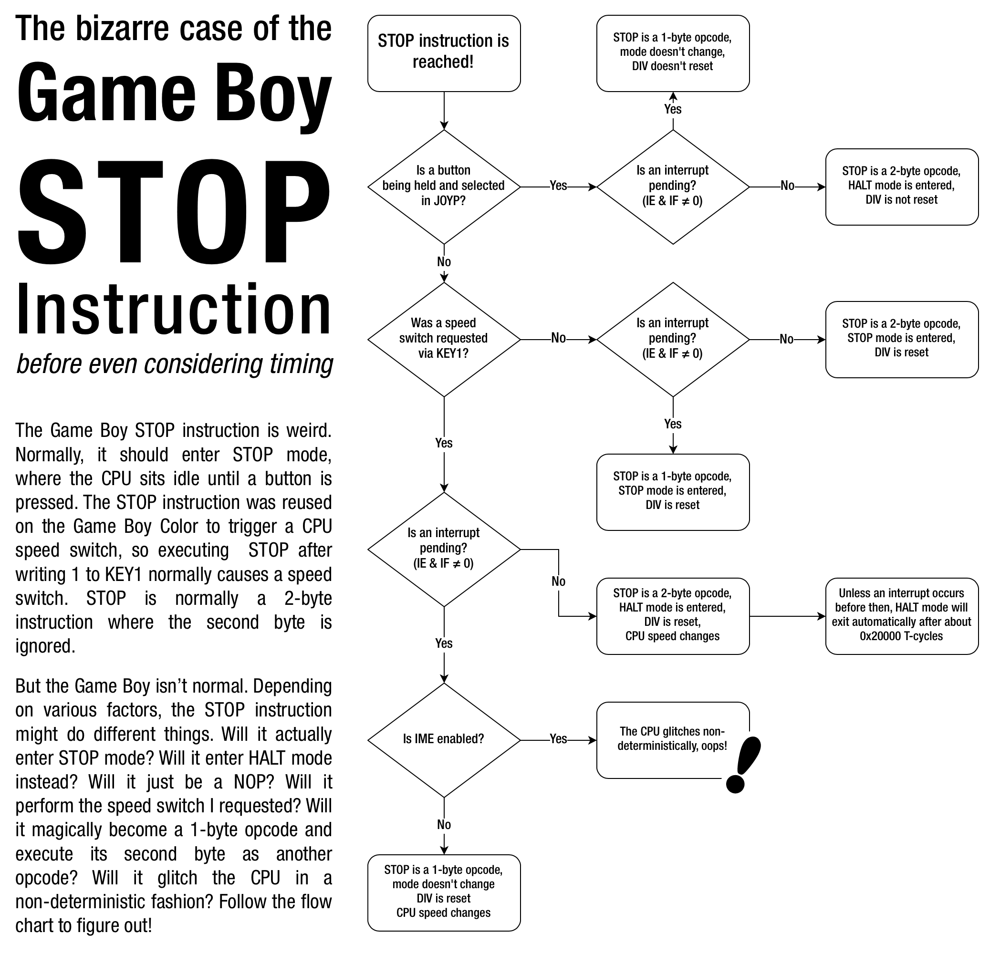

# Reducing Power Consumption

The following programming techniques can be used to reduce the power
consumption of the Game Boy hardware and extend the life of the
batteries.

## Using the HALT Instruction

The HALT instruction should be used whenever possible to reduce power
consumption.

The CPU will remain halted until an interrupt *enabled by [the IE register ($FFFF)](<#FFFF — IE: Interrupt enable>)* is
flagged in IF, at which point the interrupt is serviced if IME is enabled,
and then execution continues at the instruction immediately following the
HALT.

Depending on how much CPU time is required by a game, the HALT
instruction can extend battery life anywhere from 5% to 50% or possibly
more.

When waiting for a VBlank event, this would be a BAD example:

```rgbasm
.wait
    ld   a, [$FF44] ; LY
    cp   a, 144
    jr   nz, .wait
```

A better example would be a procedure as shown below. In this case the
VBlank interrupt must be enabled, and your VBlank interrupt handler
must set `vblank_flag` (a one-byte variable allocated in RAM) to a non-zero value.

```rgbasm
  ld   hl, vblank_flag  ; hl = pointer to vblank_flag
  xor  a                ; a = 0
.wait
  halt                  ; suspend CPU - wait for ANY enabled interrupt
  cp   a, [hl]          ; is the vblank_flag still zero?
  jr   z, .wait         ; keep waiting if zero
  ld   [hl], a          ; set the vblank_flag back to zero
```

The `vblank_flag` variable is used to determine whether the HALT period has been
terminated by a VBlank interrupt or by another interrupt. Note though
that a VBlank interrupt might happen after the cp instruction
and before the jr, in which case the interrupt would go unnoticed by the
procedure, which would jump again into a halt.

Another possibility is, if your game uses no other interrupt than VBlank
(or uses no interrupts), to only enable VBlank interrupts and simply use
a HALT instruction, which will only resume main code execution when a
VBlank occurs.

Remember, when using HALT to wait between VBlanks, that your interrupt
handlers MUST enable interrupts (using EI before returning, or
better, using the RETI instruction)

## Using the STOP Instruction

The STOP instruction is intended to switch the Game Boy into VERY low
power standby mode. For example, a program may use this feature when it
hasn't sensed keyboard input for a longer period (for example, when
somebody forgot to turn off the Game Boy).

No licensed rom makes use of STOP outside of CGB speed switching.
Special care needs to be taken if you want to make use of the STOP
instruction.

On a DMG, disabling the LCD before invoking STOP leaves the LCD enabled,
drawing a horizontal black line on the screen and very likely damaging the
hardware.

On CGB, leaving the LCD enabled when invoking STOP will result in a
black screen. Except if the LCD is in Mode 3, where it will keep drawing
the current screen.

STOP is terminated by one of the P10 to P13 lines going low. For this
reason, d-pad and/or button inputs should be enabled by writing $00,
$10 or $20 to the `P1` register before entering STOP (depending on which
buttons you want to terminate the STOP on).

<p align="center">

<br>
  <i>Source: Lior Halphon</i>
</p>

## Disabling the Sound Controller

If your program doesn't use sound at all (or during some periods) then
write $00 to register FF26 to save 16% or more on GB power consumption.
Sound can be turned back on by writing $80 to the same register, all
sound registers must be then re-initialized. When the Game Boy is turned
on, sound is enabled by default, and must be turned off manually when
not used.

## Not using CGB Double Speed Mode

Because CGB Double Speed mode consumes more power, it's recommended to
use normal speed when possible. There's limited ability to switch
between both speeds, for example, a game might use normal speed in the
title screen, and double speed in the game, or vice versa. However,
during speed switch, the display collapses for a short moment, so it's
not a good idea to alter speeds within active game or title screen
periods.

## Using the Skills

Most of the above power saving methods will produce best results when
using efficient and tight assembler code which requires as little CPU
power as possible. Using a high level language will require more CPU
power and these techniques will not have as big as an effect.

To optimize your code, it might be a good idea to look at [this
page](http://wikiti.brandonw.net/index.php?title=Z80_Optimization),
although it applies to the original Z80 CPU, so one must adapt the
optimizations to the GBZ80.

