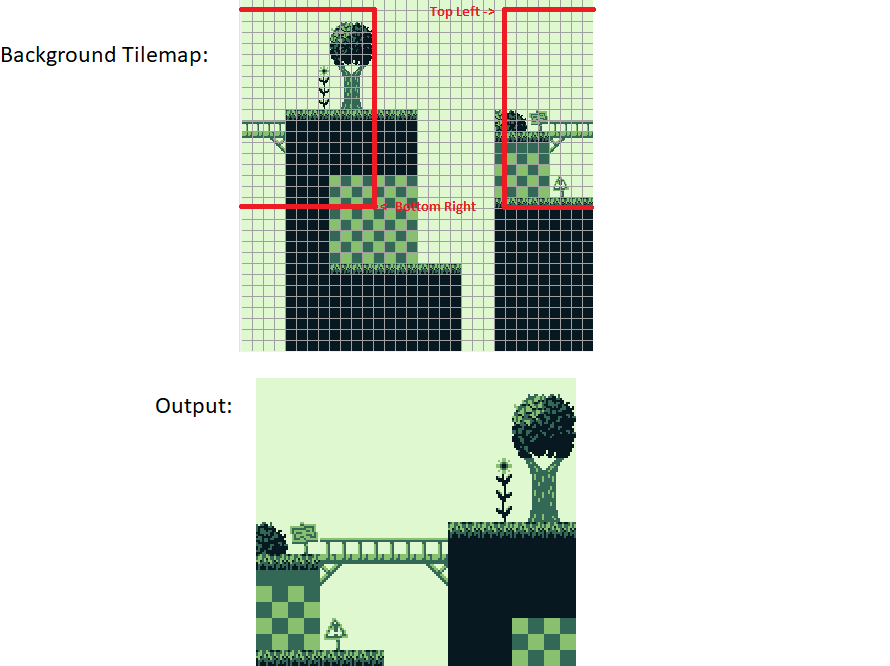

# LCD Position and Scrolling

These registers can be accessed even during Mode 3, but modifications may not take
effect immediately (see further below).

## FF42–FF43 — SCY, SCX: Background viewport Y position, X position

These two registers specify the top-left coordinates of the visible 160×144 pixel area within the
256×256 pixels BG map. Values in the range 0–255 may be used.

The PPU calculates the bottom-right coordinates of the viewport with those formulas: `bottom := (SCY + 143) % 256` and `right := (SCX + 159) % 256`.
As suggested by the modulo operations, in case the values are larger than 255 they will "wrap around" towards the top-left corner of the tilemap.

<figure><figcaption>

Example from the homebrew game *Mindy's Hike*:

</figcaption>

</figure>

## FF4A–FF4B — WY, WX: Window Y position, X position plus 7

These two registers specify the on-screen coordinates of [the Window](#Window)'s top-left pixel.

The Window is visible (if enabled) when both coordinates are in the ranges
WX=0..166, WY=0..143 respectively. Values WX=7, WY=0 place the Window at the
top left of the screen, completely covering the background.

:::warning Warning

WX values 0 and 166 are unreliable due to hardware bugs.

If WX is set to 0, the window will "stutter" horizontally when SCX changes
(depending on SCX % 8).

If WX is set to 166, the window will span the entirety of the following
scanline.

:::

## Mid-frame behavior

### Scrolling

The scroll registers are re-read on each [tile fetch](<#Get Tile>), except for the low 3 bits of SCX, which are only read at the beginning of the scanline (for the initial shifting of pixels).

All models before the CGB-D read the Y coordinate once for each bitplane (so a very precisely timed SCY write allows "desyncing" them), but CGB-D and later use the same Y coordinate for both no matter what.

### Window

While the Window should work as just mentioned, writing to WX, WY etc. mid-frame shows a more articulated behavior.

For the window to be displayed on a scanline, the following conditions must be met:

- **WY condition was triggered**: i.e. at some point in this frame the value of WY was equal to LY (checked at the start of Mode 2 only)
- **WX condition was triggered**: i.e. the current X coordinate being rendered + 7 was equal to WX
- Window enable bit in LCDC is set

If the WY condition has already been triggered and at the start of a row the window enable bit was set,
then resetting that bit before the WX condition gets triggered on that row yields a nice window glitch pixel where the window would have been activated.

The way the Window selects which line of its tilemap to render may be surprising: the Y position is selected by an internal counter, which is reset to 0 during VBlank and **only** incremented when the Window starts being rendered on a given scanline.
In particular, this means that hiding the Window mid-frame in any way (via either `WX` or `LCDC`, usually to display a status bar at the top *and* bottom of the screen) will also inhibit incrementing that Y-position counter.
