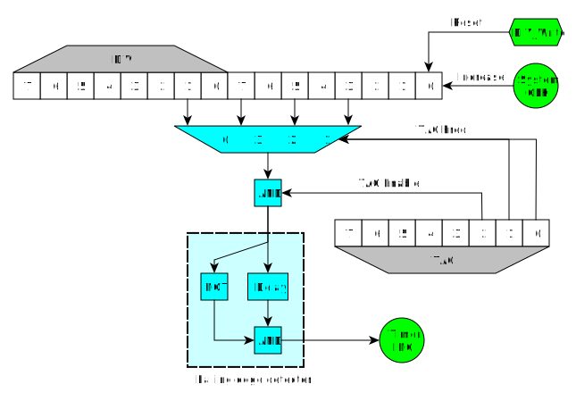
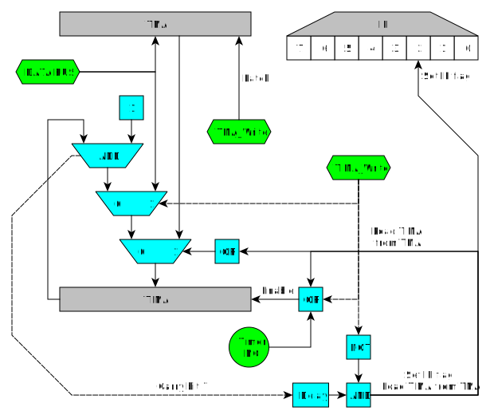

# Timer obscure behaviour

## Timer Global Circuit


## Relation between Timer and Divider register

This is a schematic of the circuit involving TAC and DIV:



Notice how the values that are connected to the inputs of the
multiplexer are the values of those bits, not the carry of those bits.
This is the reason of a few things:

- When writing to DIV, the whole counter is reset, so the timer is
also affected.

- When writing to DIV, if the current output is 1 and timer is
enabled, as the new value after reseting DIV will be 0, the falling
edge detector will detect a falling edge and TIMA will increase.

- When writing to TAC, if the previously selected multiplexer input was
1 and the new input is 0, TIMA will increase too. This doesnt
happen when the timer is disabled, but it also happens when disabling
the timer (the same effect as writing to DIV). The following code explains the behaviour in DMG and MGB.

```
    clocks_array[4] = {1024, 16, 64, 256}

    old_clocks = clocks_array[old_TAC&3]
    new_clocks = clocks_array[new_TAC&3]

    old_enable = old_TAC & BIT(2)
    new_enable = new_TAC & BIT(2)

    sys_clocks = 16 bit system counter

    IF old_enable == 0 THEN
        glitch = 0 (*)
    ELSE
        IF new_enable == 0 THEN
            glitch = (sys_clocks & (old_clocks/2)) != 0
        ELSE
            glitch = ((sys_clocks & (old_clocks/2)) != 0) && ((sys_clocks & (new_clocks/2)) == 0)
        END IF
    END IF
```

The sentence marked with a (\*) has a different behaviour in GBC (AGB
and AGS seem to have strange behaviour even in the other statements).
When enabling the timer and maintaining the same frequency it doesnt
glitch. When disabling the timer it doesnt glitch either. When another
change of value happens (so timer is enabled after the write), the
behaviour depends on a race condition, so it cannot be predicted for
every device.

## Timer Overflow Behaviour

When TIMA overflows, the value from TMA is loaded and IF timer flag is
set to 1, but this doesnt happen immediately. Timer interrupt is
delayed 1 cycle (4 clocks) from the TIMA overflow. The TMA reload to
TIMA is also delayed. For one cycle, after overflowing TIMA, the value
in TIMA is $00, not TMA. This happens only when an overflow happens, not
when the upper bit goes from 1 to 0, it cant be done manually writing
to TIMA, the timer has to increment itself.

For example (SYS is the system internal counter divided by 4 for easier
understanding, each increment of the graph is 1 cycle, not 1 clock):

    Timer overflows:

                  [A] [B]
    SYS  FD FE FF |00| 01 02 03
    TIMA FF FF FF |00| 23 23 23
    TMA  23 23 23 |23| 23 23 23
    IF   E0 E0 E0 |E0| E4 E4 E4

    Timer doesn't overflow:

                  [C]
    SYS  FD FE FF 00 01 02 03
    TIMA 45 45 45 46 46 46 46
    TMA  23 23 23 23 23 23 23
    IF   E0 E0 E0 E0 E0 E0 E0

- During the strange cycle \[A\] you can prevent the IF flag from being
set and prevent the TIMA from being reloaded from TMA by writing a value
to TIMA. That new value will be the one that stays in the TIMA register
after the instruction. Writing to DIV, TAC or other registers wont
prevent the IF flag from being set or TIMA from being reloaded.

- If you write to TIMA during the cycle that TMA is being loaded to it
\[B\], the write will be ignored and TMA value will be written to TIMA
instead.

- If TMA is written the same cycle it is loaded to TIMA \[B\], TIMA is
also loaded with that value.

- This is a guessed schematic to explain the priorities with registers
TIMA and TMA:



TMA is a latch. As soon as it is written, the output shows that value.
That explains that when TMA is written and TIMA is being incremented,
the value written to TMA is also written to TIMA. It doesnt affect the
IF flag, though.
